<style>
h1.title { text-align: center;}
h3.subtitle { text-align: center;}
h4.author { text-align: center;}
</style>

<style>
#TOC {background-color: #f0f8ff; /* light blue */ padding: 15px; border-radius: 8px; border: 1px solid #ccc;}
</style>

<style>
p { text-align: justify;}
</style>

<style>
h2 { background-color: #e6f2ff;   /* light blue highlight */ padding: 6px 10px;
  border-radius: 4px;}
</style>


## Abstract
This project investigates how climate change may influence tourism activity in the canton of Lucerne (Luzern). Tourism represents a key economic sector in the region and exhibits strong seasonal patterns, particularly driven by winter sports and summer leisure tourism. Increasing global warming and changing weather conditions raise concerns about the long-term sustainability of tourism-dependent alpine regions.
To analyse this relationship, the study combines empirical time-series analysis with a system dynamics modelling approach. Tourism demand is represented through overnight stay data, while climatic conditions are measured using weather and snowfall indicators obtained from MeteoSwiss. The time-series analysis is used to identify seasonal patterns and long-term trends in tourism demand, while the system dynamics model explores the interactions between climate conditions, tourism flows, and economic feedback mechanisms.
The findings provide insights into how climate change may affect tourism seasonality and highlight potential sustainability challenges for regional tourism development. While the analysis does not aim to establish direct causal relationships, it identifies meaningful trends and systemic interactions that can inform future research and policy considerations.

## Problem Statement
Tourism is a significant economic and social activity in Switzerland and plays an important role in the canton of Lucerne. The region attracts both domestic and international visitors, contributing to local employment, infrastructure development, and regional economic growth. Tourism demand in Lucerne exhibits strong seasonal patterns, with winter tourism largely driven by snow-dependent activities such as skiing, while summer tourism is influenced by outdoor recreation and natural attractions.
However, climate change is increasingly altering temperature patterns, precipitation levels, and snow availability in alpine regions. Rising temperatures may reduce snow reliability and shorten winter sports seasons, potentially affecting tourism flows and regional economic performance. At the same time, warmer temperatures may increase summer tourism attractiveness, potentially shifting tourism demand across seasons.
Understanding how tourism demand responds to changing climate conditions is therefore essential for long-term regional planning and sustainability considerations. This study explores how climate change may influence tourism dynamics in Lucerne by analysing historical data and modelling system interactions between climatic factors and tourism activity.

## Research Question
Main question: How might climate change influence tourism activity in the canton of Lucerne?

Sub-questions?
<br>
1. What is the busiest tourism season?
<br>
2. Has winter tourism declined?
<br>
3. Has summer tourism increased?

## Relevance & Sustainability
Tourism in alpine regions is highly dependent on environmental conditions, making it particularly vulnerable to climate change. Reduced snow reliability can threaten winter tourism infrastructure, employment, and local economic stability. As snow seasons shorten and weather patterns become more unpredictable, destinations may face increased operational costs, pressure to invest in artificial snowmaking, and the need to diversify tourism offerings. At the same time, seasonal shifts may require infrastructure adaptation and long‑term strategic planning to maintain regional competitiveness
This research contributes to sustainability discussions by analysing how climate-related environmental changes may influence tourism demand and regional economic systems. The study is particularly relevant in the context of sustainable tourism development and climate adaptation strategies, aligning with global sustainability objectives such as climate action and sustainable economic growth. The project directly relates to key Sustainable Development Goals, including **SDG 8 (Decent Work and Economic Growth), SDG 11 (Sustainable cities and communities and SDG 13 (Climate Action)**, by examining how climate vulnerability intersects with economic dependency and the future viability of alpine tourism.

## System Maps
To build a clear foundation for our system dynamics model, we began with a series of design‑thinking exercises aimed at refining both our research question and our understanding of the broader climate–tourism system.

<Center>
{width=50%}
</Center>
<br>
As one of the initial steps, we conducted a problem framing exercise to refine the research question. Using a series of “how might we” prompts, we explored the different perspectives on the relationship between climate change, snow fall and tourism demand, and economic performance ranging from the tourism in canton luzern to the specific case of sorenberg ski area and its hotel sector. This process allowed the group to compare different questions identifying which ones were too broad and which ones were too narrow. Through this iterative approach we aligned on a focused research question.
</Center>
<br>
<Center>
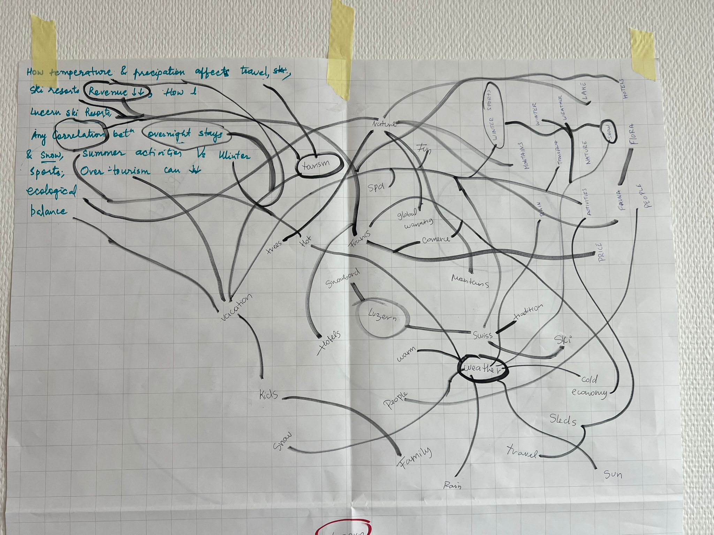{width=50%}
</Center>
<br>
After focusing on the research question and seeing what data we conducted an exploratory mapping exercise from design thinking. This is done by brainstorming words that we associate with our question and our topic. After we each wrote the word we searched for the connection that there was within them and highlighted the most relevant ones for us.This process helped identify potential relationships, interdependencies and feedback between climate and tourism.
<br>
<Center>
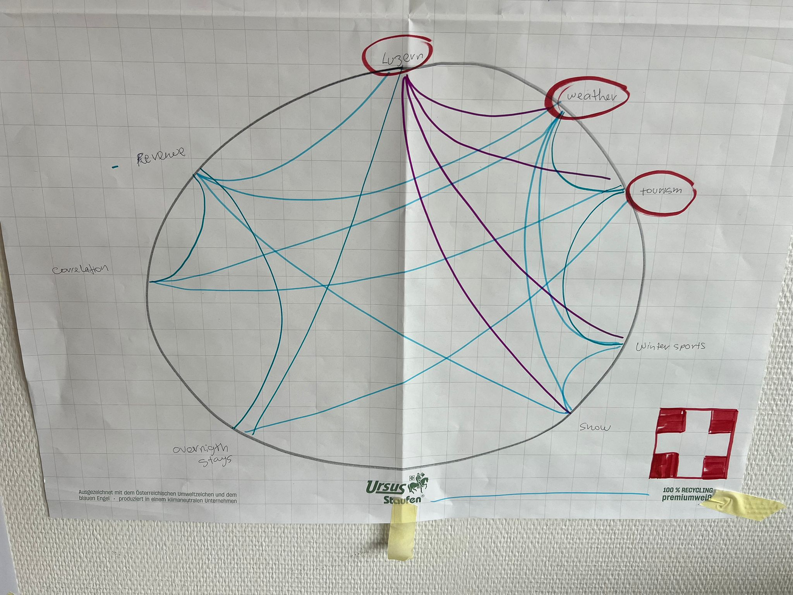{width=50%}
</Center>
<br>
After the initial brainstorming, we organized the variables into a simplified relationship map centered around our most connected worlds in the exploratory mapping. This step helped clarify the main correlations and interactions in the system and guided the transition from exploratory ideas to the structured system dynamics model used in the analysis.

<br>
<Center>
{width=50%}
</Center>
<br>
Our last design thinking step was to create a way to communicate our problem with drawings. So we try to communicate how global warming is affecting the hotel industry and how if it continues the tourism will finish shifting into summer tourism.

### **Shareholder matrix**
<br>
<Center>
{width=50%}
</Center>
<br>
The concentric circles illustrate how closely each stakeholder group is connected to the project. Those in the **Direct circle** such as hotel owners, tourists, and local businesses are the core actors who are immediately and consistently affected by project decisions. The **Indirect circle** includes groups like ski instructors, hotel employees, sport stores, and SBB, who feel the impact more gradually or through secondary channels. The **Unintended circle** captures stakeholders who are influenced unintentionally or only in specific scenarios, such as students, builders, supermarkets, restaurants, airlines, and climate activists. This ring structure helps clarify who is most central to the project and who requires broader monitoring or occasional engagement.

<br>
<Center>
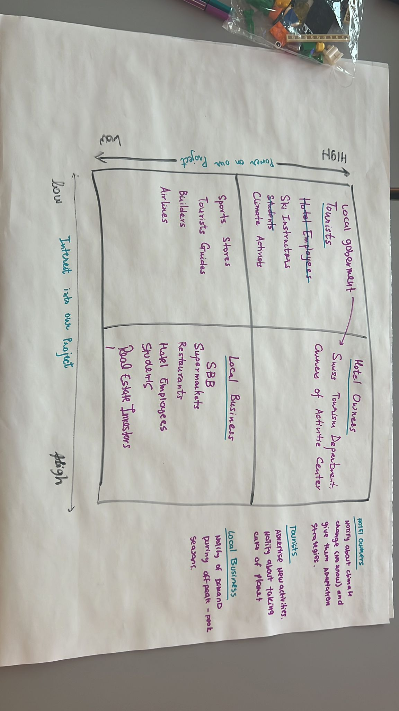{width=50%}
</Center>
<br>
After finding the interested groups we did a stakeholder matrix for the different groups based on two dimensions: how much power they have over the project and how interested they are in it. Stakeholders with high power and high interest like local government, hotel owners, and tourism authorities are the key players who must be closely managed and actively engaged. Those with high power but low interest, such as sports stores or climate activists, should be kept satisfied so they don’t become blockers. Groups with high interest but low power, like local businesses or students, benefit from regular communication and involvement. Finally, stakeholders with low power and low interest, such as builders or airlines, require minimal but respectful monitoring. This matrix helps prioritize communication and tailor strategies for each group.

## System Dynamics
To analyse the complex interactions between climate change and tourism demand in Lucerne, we developed a system dynamics model that captures the key feedback loops and relationships within the tourism system. The model includes variables representing climatic conditions (e.g., temperature, snowfall), tourism demand (e.g., overnight stays), economic performance (e.g., revenue, employment), and adaptation measures (e.g., infrastructure investment, marketing efforts).

### **Casual Loop Diagram**
<br>
<Center>
{width=50%}
</Center>
<br>
This diagram done in LOOPY  helps illustrate a simplified system dynamics representation of tourism in luzern in summer and in winter, highlighting the interactions between climate conditions and tourism related economic activity. In the diagram it is illustrated how snow availability positively influences tourism levels, which in turn increase overnight stays and generate higher tourism revenue. Increased revenue supports investment in hotel capacity, further reinforcing tourism demand through a positive feedback loop. At the same time, global warming negatively affects snow availability, introducing a balancing mechanism that can reduce tourism activity, particularly during winter seasons. By linking climatic factors, tourism demand, and economic feedback, the model provides a systemic framework for understanding how climate change may influence tourism patterns over time, while acknowledging that these relationships represent simplified dynamics rather than precise causal effects.

### **Stock and Flow Diagram**

<br>
<Center>
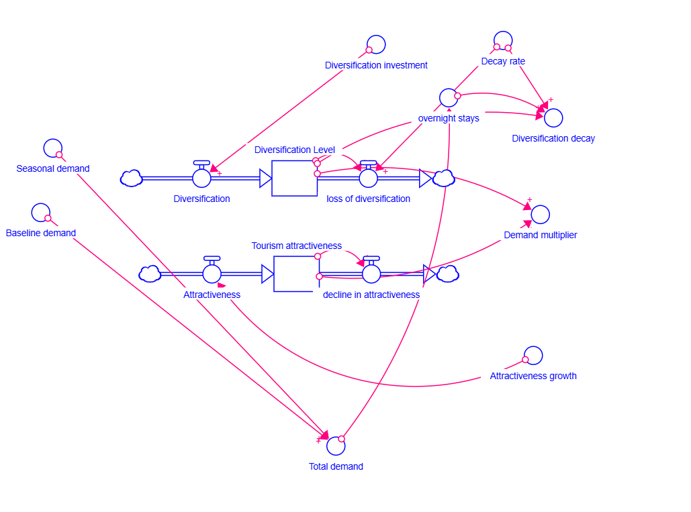{width=50%}
</Center>
<br>
This system dynamics model produced in Stella uses a structured stock–flow approach to help understand the interaction between tourism diversification, destination attractiveness and demand. Diversification and attractiveness are modelled as cumulative stocks that grow through investment and natural development processes, and decline through natural decay mechanisms. This represents long-term structural change in the tourism system. Demand emerges from the interaction between baseline demand, seasonal demand and a demand multiplier that is influenced by the performance of the system. The model structure generates reinforcing feedback loops, which drive growth through positive interactions between diversification, attractiveness and demand, as well as balancing feedback loops, which introduce natural limits through decay and saturation effects. This feedback structure enables the model to simulate dynamic behaviours such as growth, stabilisation and long-term equilibrium, rendering it suitable for scenario analysis and the evaluation of sustainability-oriented policies.
<br>
<br>

### **System Dynamics Python Model**
<br>
To complement our system dynamics analysis, we developed a Python-based model that simulates the interactions between climate change and tourism demand in Lucerne. The model incorporates key variables. Using historical data from MeteoSwiss and tourism statistics, we calibrated the model to reflect observed trends and seasonal patterns.

<details>
<summary><strong>Turist System Dynamics Python Code BPTK </strong></summary>

```python
import pandas as pd
import numpy as np
import matplotlib.pyplot as plt

# 1. DATEN LADEN & BEREINIGEN
# Laden mit robusten Einstellungen
stays_df = pd.read_csv("/content/drive/MyDrive/Sustainability Analytics/overnight_stays.csv")
weather_df = pd.read_csv("/content/drive/MyDrive/Sustainability Analytics/Luzern-TS.csv", sep=';')

# Spaltennamen bereinigen (verhindert Fehler durch Leerzeichen wie " Year")
stays_df.columns = stays_df.columns.str.strip()
weather_df.columns = weather_df.columns.str.strip()

# Robustere Extraktion von Jahr und Monat (behandelt Datum als Text)
def extract_date_parts(date_val):
    d_str = str(date_val)
    if '.' in d_str:
        year, month = d_str.split('.')
        # Falls Monat "1" statt "10" ist (z.B. 2005.1), korrigieren
        if len(month) == 1: month = month + '0'
        return int(year), int(month)
    return int(float(d_str)), 1 # Fallback

stays_df[['Year', 'Month']] = stays_df['Date'].apply(lambda x: pd.Series(extract_date_parts(x)))

# Sicherstellen, dass die Typen für den Merge exakt gleich sind
weather_df['Year'] = weather_df['Year'].astype(int)
weather_df['Month'] = weather_df['Month'].astype(int)

# 2. DATA MERGE
df = pd.merge(stays_df, weather_df, on=['Year', 'Month'], how='inner')
df = df.sort_values(['Year', 'Month']).reset_index(drop=True)

# PRÜFUNG: Falls df leer ist, stoppen wir hier mit einer Fehlermeldung
if df.empty:
    print("FEHLER: Der Merge war nicht erfolgreich. Überprüfen Sie die Datumsformate!")
    print("Stays-Vorschau:\n", stays_df[['Year', 'Month']].head())
    print("Weather-Vorschau:\n", weather_df[['Year', 'Month']].head())
else:
    print(f"Erfolgreich gemerged: {len(df)} Zeilen.")

    # 3. LOOKUPS & BASELINE
    seasonal_baseline = df.groupby('Month')['Overnight stays'].mean().to_dict()
    temp_lookup = df['Temperature'].to_dict()

    # 4. SIMULATION
    def run_simulation(invest_rate):
        dt = 1
        tourists_stock = df.loc[0, 'Overnight stays']
        winter_div_stock = 10.0
        results = []

        for t in range(len(df)):
            month = df.loc[t, 'Month']
            temp = temp_lookup[t]

            # Behandlung von fehlenden Temperaturwerten (NaN)
            weather_effect = 1.1 if (pd.notnull(temp) and temp < 5) else 1.0

            investment_flow = invest_rate * (tourists_stock * 0.01)
            winter_div_stock += investment_flow * dt

            # Converter Logic
            modeled_stays = (seasonal_baseline[month] * 0.8) + (winter_div_stock * weather_effect)
            results.append(modeled_stays)
            tourists_stock = modeled_stays

        return results

    # 5. SCENARIOS & PLOTTING
    scenarios = {"Base": 0.05, "High Diversification": 0.15, "Low Diversification": 0.01}
    output_df = pd.DataFrame({'Observed': df['Overnight stays']})

    for name, rate in scenarios.items():
        output_df[name] = run_simulation(rate)

    plt.figure(figsize=(14, 7))
    plt.plot(output_df['Observed'], label='Observed (Actual Data)', color='black', alpha=0.6, linestyle='--')
    plt.plot(output_df['Base'], label='Modeled (Base Scenario)', color='blue', linewidth=2)
    plt.plot(output_df['High Diversification'], label='High Diversification', color='green')
    plt.plot(output_df['Low Diversification'], label='Low Diversification', color='red')

    plt.title('Tourist System Dynamics: Scenarios vs. Observed Stays')
    plt.xlabel('Months since Start')
    plt.ylabel('Overnight Stays')
    plt.legend()
    plt.grid(True, alpha=0.3)
    plt.show()

```
</details>
<br>
<Center>
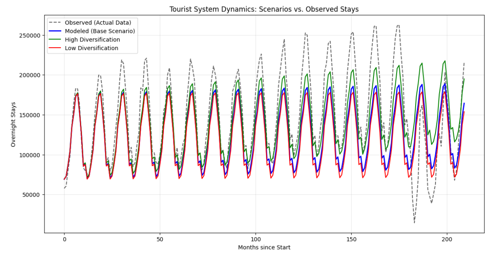{width=90%}
</Center>
<br>
The Python model simulates tourism demand under different diversification scenarios, incorporating seasonal baselines and weather effects. The results are visualized to compare observed data with modelled outcomes, providing insights into how diversification strategies may influence tourism resilience in the face of climate change.


<details>
<summary><strong>Residuals and Sanity check Python Code BPTK </strong></summary>

```python
import pandas as pd
import numpy as np
import matplotlib.pyplot as plt
import matplotlib.dates as mdates

stays_df = pd.read_csv("/content/drive/MyDrive/Sustainability Analytics/overnight_stays.csv")
weather_df = pd.read_csv("/content/drive/MyDrive/Sustainability Analytics/Luzern-TS.csv", sep=';')


# Spalten säubern
stays_df.columns = stays_df.columns.str.strip()
weather_df.columns = weather_df.columns.str.strip()

# Datum konvertieren
stays_df['Year'] = stays_df['Date'].apply(lambda x: int(float(x)))
stays_df['Month'] = stays_df['Date'].apply(lambda x: round((float(x) - int(float(x))) * 100))
df = pd.merge(stays_df, weather_df, on=['Year', 'Month'], how='inner').sort_values(['Year', 'Month']).reset_index(drop=True)
df['Date_Axis'] = pd.to_datetime(df[['Year', 'Month']].assign(Day=1))

# 2. LOOKUPS FÜR DEN CHECK
seasonal_baseline = df.groupby('Month')['Overnight stays'].mean().to_dict()
temp_lookup = df['Temperature'].to_dict()

# 3. BASE-SIMULATION (Sanity Check Version)
def run_sanity_base():
    tourists_stock = df.loc[0, 'Overnight stays']
    winter_div_stock = 10.0 # Startwert
    invest_rate = 0.05      # Standard-Investitionsrate für den Check
    results = []

    for t in range(len(df)):
        month = df.loc[t, 'Month']
        temp = temp_lookup[t]

        # Wetter-Logik
        weather_effect = 1.1 if (pd.notnull(temp) and temp < 5) else 1.0

        # Flows
        winter_div_stock += invest_rate * (tourists_stock * 0.01)

        # Converter (Das Herzstück des Modells)
        modeled_stays = (seasonal_baseline[month] * 0.8) + (winter_div_stock * weather_effect)
        results.append(modeled_stays)
        tourists_stock = modeled_stays

    return results

# Daten generieren
modeled_base = run_sanity_base()

# 4. PLOTTING: DER SANITY CHECK
plt.figure(figsize=(15, 7))

# Die echten Daten als Referenz
plt.plot(df['Date_Axis'], df['Overnight stays'], label='Observed (Historical Data)',
         color='black', alpha=0.4, linewidth=1.5, linestyle='--')

# Dein Basis-Modell
plt.plot(df['Date_Axis'], modeled_base, label='Model (Base Simulation)',
         color='#1f77b4', linewidth=2.5)

# Styling
plt.title('Sanity Check: Historical Reality vs. System Dynamics Model', fontsize=14)
plt.ylabel('Overnight Stays')
plt.gca().xaxis.set_major_formatter(mdates.DateFormatter('%Y'))
plt.gca().xaxis.set_major_locator(mdates.YearLocator())
plt.grid(True, which='both', linestyle=':', alpha=0.5)
plt.legend()

# 5. RESIDUEN-ANALYSE (Zusatz-Check)
# Zeigt die Abweichung: Wo liegt das Modell falsch?
plt.figure(figsize=(15, 3))
residuals = df['Overnight stays'] - modeled_base
plt.bar(df['Date_Axis'], residuals, color='gray', alpha=0.6, width=20)
plt.axhline(0, color='black', linewidth=0.8)
plt.title('Residuals (Difference: Observed - Modeled)', fontsize=12)
plt.ylabel('Error Margin')

plt.show()

```
</details>

<br>
<Center>
{width=90%}
</Center>
<br>
The sanity check model validates the system dynamics approach by comparing modelled tourism demand against historical data. The residual analysis highlights areas where the model deviates from observed trends, guiding further refinement and calibration efforts.

<details>
<summary><strong>Analitical Plots Python Code BPTK </strong></summary>

```python
# Create a proper datetime column for the X-axis
df['Date_Axis'] = pd.to_datetime(df[['Year', 'Month']].assign(Day=1))

# 2. LOOKUPS AND SEASONAL BASELINE
seasonal_mean = df['Overnight stays'].mean()
seasonal_baseline_map = df.groupby('Month')['Overnight stays'].mean().to_dict()
seasonal_mult = {m: val / seasonal_mean for m, val in seasonal_baseline_map.items()}

temp_lookup = df['Temperature'].values
precip_lookup = df['Precipitation'].values
actual_stays = df['Overnight stays'].values

# 3. SYSTEM DYNAMICS MODEL LOGIC
def run_sd_simulation_detailed(invest_rate):
    CAPACITY = 400000
    ADJUSTMENT_TIME = 3
    dt = 1

    tourists_in_system = actual_stays[0]
    winter_diversification = 100.0

    stays_history = []
    div_stock_history = []

    for t in range(len(df)):
        month = df.loc[t, 'Month']
        temp = temp_lookup[t]
        precip = precip_lookup[t]

        # Converters
        rain_effect = 1.0 - (max(0, precip - 100) / 2000)
        winter_benefit = 1.0
        if temp < 8:
            winter_benefit = 1.0 + (winter_diversification / 50000) * (8 - temp) * 0.05

        overnight_stays_model = tourists_in_system * seasonal_mult[month] * rain_effect * winter_benefit

        # Flows
        invest_flow = (overnight_stays_model * invest_rate)
        capacity_mult = max(0, (CAPACITY - tourists_in_system) / CAPACITY)
        target_tourists = overnight_stays_model

        if target_tourists > tourists_in_system:
            tourist_net_flow = (target_tourists - tourists_in_system) / ADJUSTMENT_TIME * capacity_mult
        else:
            tourist_net_flow = (target_tourists - tourists_in_system) / ADJUSTMENT_TIME

        # Update Stocks
        winter_diversification += invest_flow * dt
        tourists_in_system += tourist_net_flow * dt
        winter_diversification = min(winter_diversification, 100000)

        stays_history.append(overnight_stays_model)
        div_stock_history.append(winter_diversification)

    return {'stays': stays_history, 'div_stock': div_stock_history}

# 4. EXECUTE SCENARIOS
scenarios = {
    "Base Scenario (5%)": 0.05,
    "High Diversification (15%)": 0.15,
    "Low Diversification (1%)": 0.01
}

# This creates the 'results' variable correctly
results = {label: run_sd_simulation_detailed(rate) for label, rate in scenarios.items()}

# 5. GENERATE ANALYTICAL PLOTS

# Plot 1: Main Overnights Stays Comparison
plt.figure(figsize=(12, 6))
plt.plot(df['Date_Axis'], df['Overnight stays'], color='black', alpha=0.3, label='Observed (Actual)')
for label, data in results.items():
    plt.plot(df['Date_Axis'], data['stays'], label=label)
plt.title('Luzern Tourism Dynamics: Policy Scenarios (2005-2022)')
plt.ylabel('Overnight Stays')
plt.legend()
plt.grid(True, alpha=0.3)
plt.show()


# Plot 3: Resilience Analysis (Temp vs Stays in Late Years)
plt.figure(figsize=(10, 6))
late_mask = df['Year'] >= 2020
plt.scatter(df.loc[late_mask, 'Temperature'], results["Low Diversification (1%)"]['stays'][-len(df[late_mask]):], alpha=0.5, label='Low Div (Late)', color='red')
plt.scatter(df.loc[late_mask, 'Temperature'], results["High Diversification (15%)"]['stays'][-len(df[late_mask]):], alpha=0.5, label='High Div (Late)', color='green')
plt.title('Climate Resilience: Stays at Low Temperatures (2020-2022)')
plt.xlabel('Temperature (°C)')
plt.ylabel('Stays')
plt.legend()
plt.grid(True, alpha=0.3)
plt.show()

# Plot 4: Cumulative Economic Output
plt.figure(figsize=(10, 5))
for label, data in results.items():
    plt.plot(df['Date_Axis'], np.cumsum(data['stays']), label=label)
plt.title('Cumulative Impact: Total Stays over 17 Years')
plt.ylabel('Cumulative Sum of Stays')
plt.legend()
plt.grid(True, alpha=0.3)
plt.show()

```
</details>

<br>
<Center>
{width=90%}
{width=100%}
{width=100%}
</Center>
<br>
The detailed system dynamics simulation incorporates additional factors such as temperature and Stays over time constraints, providing a more detailed
understanding of tourism dynamics. The scenario analysis highlights the potential benefits of diversification strategies in enhancing climate resilience and sustaining tourism demand over time.

## Time Series Analysis

To complement our system dynamics modelling, we conducted two time-series analysis of tourism demand in Lucerne
using historical overnight stay data from 2005 to 2022. Both analysis focused on identifying seasonal patterns, trends, and potential correlations with climatic variables such as temperature and snowfall.

<br>

### **SARIMA**
This study applied a Seasonal AutoRegressive Integrated Moving Average (SARIMA) model to analyse long-term and seasonal patterns in climate-related environmental variables and their relationship to tourism dynamics in the canton of Lucerne. SARIMA is specifically designed for time series data exhibiting both trends and seasonality, making it a suitable method for analysing climatic indicators such as snow cover duration, season length proxies and interannual variability.

The model decomposes observed time series into seasonal components, long-term trends and short-term fluctuations. This allows the study to:

1. Detect structural changes in winter conditions over time (e.g. declining snow reliability);

2. Identify shifts in seasonal intensity and duration;

3. Quantify temporal persistence and cyclical behaviour in climate variables.

This is directly aligned with the research questions on seasonal tourism dynamics, particularly with regard to assessing whether winter tourism conditions are weakening and whether summer conditions are becoming more dominant. By capturing temporal dependence and seasonal autocorrelation, SARIMA provides a statistically robust framework with which to evaluate climate-driven transformations in tourism-relevant environmental conditions.

Therefore, SARIMA was selected as an analytical tool for structural time-series interpretation, not just for short-term forecasting, to support evidence-based conclusions on the impacts of climate change, shifts in tourism seasonality, and the long-term sustainability implications for alpine tourism systems.

<details>
<summary><strong> SARIMA Data Analysis Code </strong></summary>

```python

import pandas as pd
import numpy as np
import os
import matplotlib.pyplot as plt

BASE_PATH = "/content/drive/MyDrive/Sustainability Analytics/"

print("Files in folder:")
print(os.listdir(BASE_PATH))

# --------------------------------------------
# Helpers

def parse_time_col(df, col="time"):
    """Parse time column robustly: try YYYYMMDD first, then generic parsing."""
    s = df[col].astype(str).str.strip()
    t = pd.to_datetime(s, format="%Y%m%d", errors="coerce")
    mask = t.isna()
    if mask.any():
        t2 = pd.to_datetime(s[mask], errors="coerce")
        t.loc[mask] = t2
    if t.isna().mean() > 0.01:
        print(f"⚠️ Warning: {t.isna().mean():.2%} of '{col}' could not be parsed.")
    return t

def force_numeric(df, cols):
    """Force numeric parsing with handling '-', '…', comma decimals, coercion to NaN."""
    df = df.replace({"-": np.nan, "…": np.nan})
    for c in cols:
        if c in df.columns:
            df[c] = (
                df[c].astype(str)
                    .str.replace(",", ".", regex=False)
                    .str.strip()
            )
            df[c] = pd.to_numeric(df[c], errors="coerce")
    return df

def add_year_month_winteryear(df, time_col="time"):
    """Add year/month and winter_year (Dec belongs to next winter_year)."""
    df = df.copy()
    df["year"]  = df[time_col].dt.year
    df["month"] = df[time_col].dt.month
    df["WinterYear"] = df["year"]
    df.loc[df["month"] == 12, "WinterYear"] += 1
    return df

def season_stats_bounded(df_season, value_col, threshold, season_months):
    """
    Compute season start/end/length within the given season months only.
    df_season must contain columns: ['time','WinterYear', value_col, 'month']
    """
    df = df_season.copy()
    df = df[df["month"].isin(season_months)]
    df = df.dropna(subset=[value_col])

    # Filter by threshold
    df = df[df[value_col] > threshold]
    if df.empty:
        return pd.DataFrame({"WinterYear": [], "SeasonStart": [], "SeasonEnd": [], "SeasonLengthDays": []})

    grouped = df.groupby("WinterYear")["time"]
    out = pd.DataFrame({
        "WinterYear": grouped.min().index,
        "SeasonStart": grouped.min().values,
        "SeasonEnd": grouped.max().values
    })
    out["SeasonLengthDays"] = (out["SeasonEnd"] - out["SeasonStart"]).dt.days + 1
    return out

def scan_idaweb_excel(path):
    """
    Scan all sheets + skiprows options to find the most data-rich table.
    Returns best_df, best_sheet, best_skip, candidates_sorted
    """
    xls = pd.ExcelFile(path)
    print("\nIDAweb sheets:", xls.sheet_names)

    def nonempty_score(df):
        df2 = df.copy()
        for c in df2.columns:
            if df2[c].dtype == "object":
                df2[c] = (
                    df2[c].astype(str)
                        .str.strip()
                        .replace({"": np.nan, "nan": np.nan, "None": np.nan, "-": np.nan, "…": np.nan})
                )
        return int(df2.notna().sum().sum())

    candidates = []
    for sh in xls.sheet_names:
        for skip in [0, 1, 2, 3, 4, 5, 10, 15, 20]:
            try:
                df = pd.read_excel(path, sheet_name=sh, skiprows=skip)
                score = nonempty_score(df)
                candidates.append((score, sh, skip, df.shape, list(df.columns)))
            except Exception as e:
                candidates.append((0, sh, skip, ("ERR",), [str(e)]))

    candidates_sorted = sorted(candidates, key=lambda x: x[0], reverse=True)
    print("\nTop 10 candidate reads (score, sheet, skiprows, shape):")
    for row in candidates_sorted[:10]:
        print(row[0], row[1], "skiprows=", row[2], "shape=", row[3])

    best_score, best_sheet, best_skip, best_shape, best_cols = candidates_sorted[0]
    print("\nBEST:", best_score, best_sheet, "skiprows=", best_skip, "shape=", best_shape)
    best_df = pd.read_excel(path, sheet_name=best_sheet, skiprows=best_skip)

    return best_df, best_sheet, best_skip, candidates_sorted

def detect_date_and_value_columns(df):
    """
    Detect a date-like column + a numeric value column in IDAweb-like exports.
    Returns (date_col, value_col)
    """
    # date column
    date_col = None
    for c in df.columns:
        cl = str(c).lower()
        if any(k in cl for k in ["date", "zeit", "time", "datum", "monat", "month", "jahr", "year"]):
            date_col = c
            break
    if date_col is None:
        date_col = df.columns[0]

    # numeric value column: choose the column with most numeric parses
    candidate_cols = [c for c in df.columns if c != date_col]
    best_col, best_nonnull = None, -1
    for c in candidate_cols:
        tmp = pd.to_numeric(
            df[c].astype(str).str.replace(",", ".", regex=False).str.strip().replace({"-": np.nan, "…": np.nan}),
            errors="coerce"
        )
        nonnull = tmp.notna().sum()
        if nonnull > best_nonnull and nonnull > 0:
            best_nonnull = nonnull
            best_col = c
    if best_col is None:
        raise ValueError("Could not detect a numeric value column (e.g., overnights).")
    return date_col, best_col

# --------------------------------------------
# 1) Load MeteoSwiss time series

soerenberg = pd.read_csv(BASE_PATH + "Soerenberg-TS.csv", sep=";")
fluehli    = pd.read_csv(BASE_PATH + "Fluehli-TS.csv", sep=";")

soerenberg["time"] = parse_time_col(soerenberg, "time")
fluehli["time"]    = parse_time_col(fluehli, "time")

soerenberg = soerenberg.dropna(subset=["time"]).copy()
fluehli    = fluehli.dropna(subset=["time"]).copy()

soerenberg = force_numeric(soerenberg, ["hns000d0", "hto000d0"])
fluehli    = force_numeric(fluehli, ["tre200d0", "tre200dx", "tre200dn", "hns000d0", "rka150d0", "hto000d0"])

print("\nSoerenberg dtypes:\n", soerenberg.dtypes)
print("\nFluehli dtypes:\n", fluehli.dtypes)

soerenberg = add_year_month_winteryear(soerenberg, "time")
fluehli    = add_year_month_winteryear(fluehli, "time")

# --------------------------------------------
# 2) Define seasons

SKI_MONTHS    = [11, 12, 1, 2, 3, 4]  # realistic ski season proxy
WINTER_MONTHS = [12, 1, 2]
SUMMER_MONTHS = [6, 7, 8]

ski_s = soerenberg[soerenberg["month"].isin(SKI_MONTHS)].copy()
ski_f = fluehli[fluehli["month"].isin(SKI_MONTHS)].copy()

print("\nSki months in Soerenberg:", sorted(ski_s["month"].unique()))
print("Ski months in Fluehli:", sorted(ski_f["month"].unique()))
print("Min/max dates ski_s:", ski_s["time"].min(), ski_s["time"].max())
print("Min/max dates ski_f:", ski_f["time"].min(), ski_f["time"].max())

# --------------------------------------------
# 3) Sörenberg snow KPIs (threshold sweep)

THRESHOLDS = [0, 10, 20, 30]  # cm
kpi_list = []

for thr in THRESHOLDS:
    snow_days = (
        ski_s.groupby("WinterYear")["hns000d0"]
        .apply(lambda x: (x.dropna() > thr).sum())
        .rename(f"SnowDays_GT{thr}cm_Ski")
        .reset_index()
    )

    mean_depth = (
        ski_s.groupby("WinterYear")["hns000d0"]
        .mean()
        .rename(f"MeanSnowDepth_cm_Ski_GT{thr}cm")
        .reset_index()
    )

    season_stats = season_stats_bounded(
        df_season=ski_s,
        value_col="hns000d0",
        threshold=thr,
        season_months=SKI_MONTHS
    ).rename(columns={
        "SeasonStart": f"SeasonStart_GT{thr}cm",
        "SeasonEnd": f"SeasonEnd_GT{thr}cm",
        "SeasonLengthDays": f"SeasonLengthDays_GT{thr}cm"
    })

    base = snow_days.merge(mean_depth, on="WinterYear", how="outer")
    base = base.merge(season_stats, on="WinterYear", how="left")

    kpi_list.append(base)

kpi = kpi_list[0]
for nxt in kpi_list[1:]:
    kpi = kpi.merge(nxt, on="WinterYear", how="outer", validate="one_to_one")

kpi = kpi.sort_values("WinterYear").reset_index(drop=True)

out_kpi = BASE_PATH + "Soerenberg_SkiSeason_SnowKPIs_ThresholdSweep.csv"
kpi.to_csv(out_kpi, index=False)
print("\n✅ Snow KPI dataset saved to:", out_kpi)
display(kpi.head(10))

# --------------------------------------------
# 4) Flühli temperature feasibility KPIs

# Temperature coverage per WinterYear (count non-NaN days in ski season)
temp_coverage = ski_f.groupby("WinterYear")["tre200d0"].count().rename("TempObsCount_Ski").reset_index()

# Keep only winters with sufficient temp observations (e.g., >= 120 days out of ~181)
MIN_TEMP_OBS = 120
valid_temp_years = temp_coverage[temp_coverage["TempObsCount_Ski"] >= MIN_TEMP_OBS]["WinterYear"]

ski_f_valid = ski_f[ski_f["WinterYear"].isin(valid_temp_years)].copy()

frost_days = (
    ski_f_valid.groupby("WinterYear")["tre200d0"]
    .apply(lambda x: (x.dropna() < 0).sum())
    .rename("FrostDays_Ski_LT0C")
    .reset_index()
)

warm_days = (
    ski_f_valid.groupby("WinterYear")["tre200d0"]
    .apply(lambda x: (x.dropna() > 5).sum())
    .rename("WarmDays_Ski_GT5C")
    .reset_index()
)

temp_kpis = temp_coverage.merge(frost_days, on="WinterYear", how="left").merge(warm_days, on="WinterYear", how="left")

out_temp = BASE_PATH + "Fluehli_SkiSeason_TempKPIs.csv"
temp_kpis.to_csv(out_temp, index=False)
print("\n✅ Temp KPI dataset saved to:", out_temp)
display(temp_kpis.tail(10))

# Merge temp KPIs into kpi
kpi = kpi.merge(temp_kpis, on="WinterYear", how="left", validate="one_to_one")

# --------------------------------------------
# 5) IDAweb Tourism: scan Excel to find real data

ida_path = BASE_PATH + "Soerenberg-Idaweb.xlsx"
ida_best, ida_sheet, ida_skip, _ = scan_idaweb_excel(ida_path)

# If still basically empty, stop tourism merge gracefully
non_null_cells = int(ida_best.notna().sum().sum())

tourism_merged = False

if non_null_cells > 50:  # heuristic: avoid merging if it's just empty headers
    # Detect date + value columns
    date_col, value_col = detect_date_and_value_columns(ida_best)

    ida_best = ida_best.replace({"-": np.nan, "…": np.nan})
    ida_best[date_col] = pd.to_datetime(ida_best[date_col], errors="coerce")
    ida_best[value_col] = pd.to_numeric(
        ida_best[value_col].astype(str).str.replace(",", ".", regex=False).str.strip(),
        errors="coerce"
    )

    ida_best = ida_best.dropna(subset=[date_col]).copy()
    ida_best["year"]  = ida_best[date_col].dt.year
    ida_best["month"] = ida_best[date_col].dt.month

    ida_best["WinterYear"] = ida_best["year"]
    ida_best.loc[ida_best["month"] == 12, "WinterYear"] += 1

    # Aggregate demand
    overnights_winter_djf = (
        ida_best[ida_best["month"].isin(WINTER_MONTHS)]
        .groupby("WinterYear")[value_col]
        .sum(min_count=1)
        .rename("Overnights_Winter_DJF")
        .reset_index()
    )

    overnights_ski = (
        ida_best[ida_best["month"].isin(SKI_MONTHS)]
        .groupby("WinterYear")[value_col]
        .sum(min_count=1)
        .rename("Overnights_SkiSeason_NDJFMA")
        .reset_index()
    )

    overnights_summer = (
        ida_best[ida_best["month"].isin(SUMMER_MONTHS)]
        .groupby("year")[value_col]
        .sum(min_count=1)
        .rename("Overnights_Summer_JJA")
        .reset_index()
        .rename(columns={"year": "WinterYear"})
    )

    kpi = kpi.merge(overnights_winter_djf, on="WinterYear", how="left", validate="one_to_one")
    kpi = kpi.merge(overnights_ski, on="WinterYear", how="left", validate="one_to_one")
    kpi = kpi.merge(overnights_summer, on="WinterYear", how="left", validate="one_to_one")

    kpi["WinterShare_DJF_vs_Summer"] = kpi["Overnights_Winter_DJF"] / (kpi["Overnights_Winter_DJF"] + kpi["Overnights_Summer_JJA"])
    kpi["SkiSeasonShare_vs_Summer"]  = kpi["Overnights_SkiSeason_NDJFMA"] / (kpi["Overnights_SkiSeason_NDJFMA"] + kpi["Overnights_Summer_JJA"])

    tourism_merged = True
else:
    print("\n⚠️ IDAweb appears empty/unusable (no numeric data found). Skipping tourism merge.")

# --------------------------------------------
# 6) Save final merged dataset

out_final = BASE_PATH + "Soerenberg_FINAL_Merged_KPIs.csv"
kpi.to_csv(out_final, index=False)
print("\n✅ FINAL dataset saved to:", out_final)
display(kpi.head(10))

```
</details>

<br>
<Center>
{width=90%}
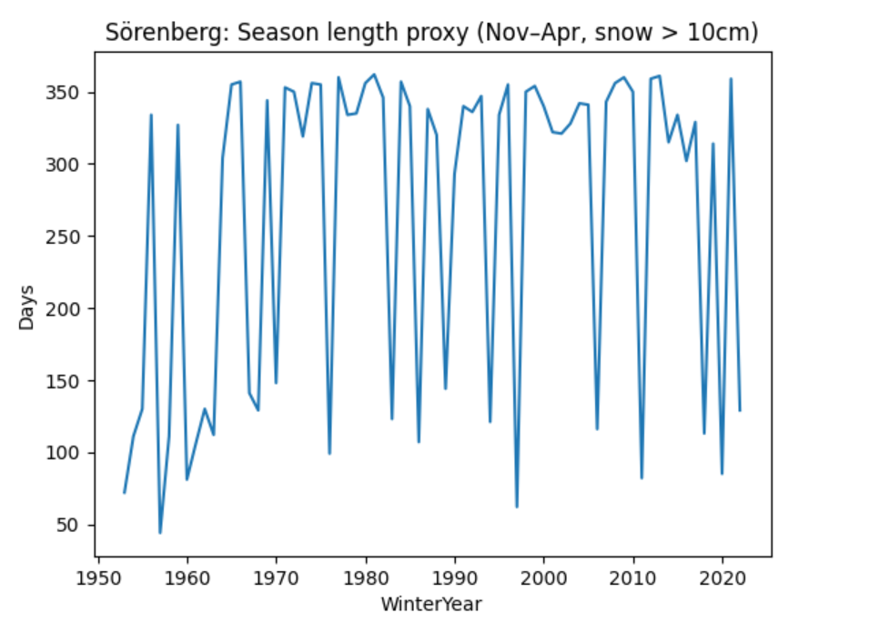{width=90%}
</Center>
<br>
The charts show a clear trend towards reduced snow reliability and greater seasonal instability in Sörenberg. Although low-threshold snow presence (≥0 cm) remains relatively frequent, higher snow depth conditions (≥10 cm) critical for winter tourism show declining persistence and strong interannual variability. The season-length proxy also shows that winter seasons are becoming more fragmented and irregular over time, reflecting shorter and less predictable snow periods. Together, these patterns provide empirical evidence of a structural weakening of winter conditions, which is consistent with the impacts of climate change on the viability of alpine tourism.

<details>
<summary><strong> SARIMA MERGE: Winter viability KPIs + Tourism demand (IDAweb) </strong></summary>

```python
import pandas as pd
import numpy as np
import matplotlib.pyplot as plt

BASE_PATH = "/content/drive/MyDrive/Sustainability Analytics/"

# --------------------------------------------
# 1) Load winter viability KPI dataset

kpi = pd.read_csv(BASE_PATH + "Soerenberg_Winter_Viability_KPIs.csv")
kpi["WinterYear"] = pd.to_numeric(kpi["WinterYear"], errors="coerce").astype("Int64")

print("KPI preview:")
display(kpi.head())

# Optional: focus on overlapping years with Fluehli temps (>=1969)
kpi = kpi[kpi["WinterYear"] >= 1969].copy()

# --------------------------------------------
# 2) Load IDAweb tourism dataset

ida = pd.read_excel(BASE_PATH + "Soerenberg-Idaweb.xlsx")

print("\nIDAweb columns:")
print(list(ida.columns))
print("\nIDAweb preview:")
display(ida.head(10))

# --------------------------------------------
# 3) Try to identify date + overnight columns


date_col = None
for c in ida.columns:
    if "date" in str(c).lower() or "zeit" in str(c).lower() or "time" in str(c).lower() or "datum" in str(c).lower():
        date_col = c
        break

# if not found, try the first column if it looks date-like
if date_col is None:
    date_col = ida.columns[0]

# convert date column
ida[date_col] = pd.to_datetime(ida[date_col], errors="coerce")

# choose an "overnights" column:
# pick the first numeric-looking column excluding the date col
overnight_col = None
candidate_cols = [c for c in ida.columns if c != date_col]

# try convert candidates to numeric and choose the one with most non-nulls
best_col = None
best_nonnull = -1
for c in candidate_cols:
    tmp = pd.to_numeric(
        ida[c].astype(str).str.replace(",", ".", regex=False).str.strip(),
        errors="coerce"
    )
    nonnull = tmp.notna().sum()
    if nonnull > best_nonnull and nonnull > 0:
        best_nonnull = nonnull
        best_col = c

overnight_col = best_col

if overnight_col is None:
    raise ValueError("Could not detect a numeric overnights column in IDAweb file. Please check the sheet layout.")

# finalize numeric overnights
ida[overnight_col] = pd.to_numeric(
    ida[overnight_col].astype(str).str.replace(",", ".", regex=False).str.strip(),
    errors="coerce"
)

# drop invalid dates / values
ida = ida.dropna(subset=[date_col]).copy()

# --------------------------------------------
# 4) Build WinterYear and SummerYear aggregations

ida["year"]  = ida[date_col].dt.year
ida["month"] = ida[date_col].dt.month

ida["WinterYear"] = ida["year"]
ida.loc[ida["month"] == 12, "WinterYear"] += 1

winter_mask = ida["month"].isin([12, 1, 2])
summer_mask = ida["month"].isin([6, 7, 8])

winter_overnights = (
    ida.loc[winter_mask]
      .groupby("WinterYear")[overnight_col]
      .sum(min_count=1)
      .rename("Overnights_Winter_DJF")
      .reset_index()
)

summer_overnights = (
    ida.loc[summer_mask]
      .groupby("year")[overnight_col]
      .sum(min_count=1)
      .rename("Overnights_Summer_JJA")
      .reset_index()
      .rename(columns={"year": "WinterYear"})  # align on the same year key for merging convenience
)


# --------------------------------------------
# 5) Merge KPIs + Tourism proxies

merged = kpi.merge(winter_overnights, on="WinterYear", how="left")
merged = merged.merge(summer_overnights, on="WinterYear", how="left")

# create a simple "Winter dependency" indicator (optional)
merged["WinterShare"] = merged["Overnights_Winter_DJF"] / (merged["Overnights_Winter_DJF"] + merged["Overnights_Summer_JJA"])

out_file = BASE_PATH + "Soerenberg_Merged_WinterRisk_Tourism.csv"
merged.to_csv(out_file, index=False)

print("\n✅ Merged dataset saved to:", out_file)
display(merged.head(10))

```
</details>
<br>
<Center>
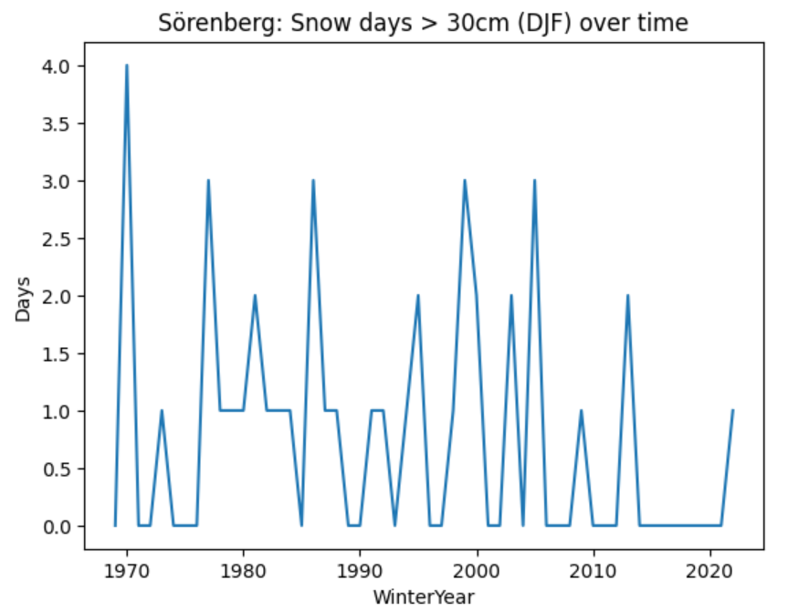{width=90%}
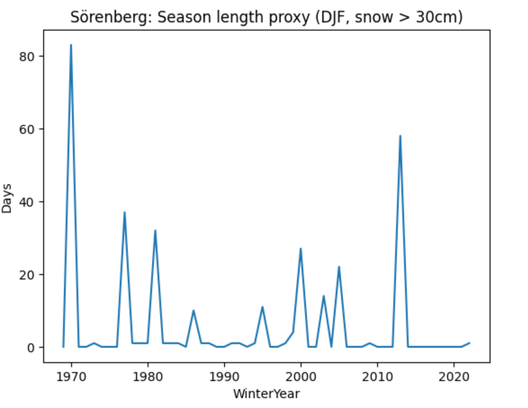{width=90%}
</Center>
<br>

<details>
<summary><strong> SARIMA Data Cleaning Code </strong></summary>

```python
import pandas as pd
import numpy as np

BASE_PATH = "/content/drive/MyDrive/Sustainability Analytics/"

# ------------------------------------------------
# 1) Load your climate KPI dataset (already built)

kpi = pd.read_csv(BASE_PATH + "Soerenberg_FINAL_Merged_KPIs.csv")
kpi["WinterYear"] = pd.to_numeric(kpi["WinterYear"], errors="coerce").astype("Int64")
print("Climate KPI dataset preview:")
display(kpi.head())

# ------------------------------------------------
# 2) Load BFS HESTA Excel (PX export)

tourism_path = BASE_PATH + "px-x-1003020000_102_20260203-112835.xlsx"
raw = pd.read_excel(tourism_path)

print("\nTourism raw columns:")
print(list(raw.columns))
display(raw.head(10))

# ------------------------------------------------
# 3) Clean: keep only rows that look like data

df = raw.dropna(how="all").copy()
df.columns = [f"c{i}" for i in range(df.shape[1])]

# Heuristic: the VALUE column is usually the last column (numeric)
# We'll coerce last column to numeric; rows that fail are meta rows.
df["value"] = pd.to_numeric(
    df[f"c{df.shape[1]-1}"].astype(str).str.replace(",", ".", regex=False).str.strip(),
    errors="coerce"
)

# Keep only rows with numeric value
df = df[df["value"].notna()].copy()

# Now we need to identify which columns correspond to Year/Month/Indicator/Canton/etc.
# We'll search each column for patterns.
def looks_like_year(s):
    x = pd.to_numeric(s, errors="coerce")
    return x.between(1900, 2100).sum()

def looks_like_month(s):
    # BFS sometimes uses 1-12 or month names; start with numeric 1-12
    x = pd.to_numeric(s, errors="coerce")
    return x.between(1, 12).sum()

# Find best year col and month col
scores = []
for c in [col for col in df.columns if col.startswith("c")]:
    scores.append((looks_like_year(df[c]), "year", c))
    scores.append((looks_like_month(df[c]), "month", c))

scores_sorted = sorted(scores, key=lambda x: x[0], reverse=True)

year_col  = next(c for sc, typ, c in scores_sorted if typ == "year" and sc > 0)
month_col = next((c for sc, typ, c in scores_sorted if typ == "month" and sc > 0 and c != year_col), None)

print("\nDetected columns:")
print("year_col =", year_col)
print("month_col =", month_col, "(None means dataset might be yearly only)")

# Create Year/Month fields
df["Year"] = pd.to_numeric(df[year_col], errors="coerce")

if month_col is not None:
    df["Month"] = pd.to_numeric(df[month_col], errors="coerce")
else:
    df["Month"] = np.nan


candidate_text_cols = [c for c in df.columns if c.startswith("c") and c not in [year_col, month_col]]
# pick the one with most unique text entries
indicator_col = None
best_unique = -1
for c in candidate_text_cols:
    uniq = df[c].astype(str).nunique()
    if uniq > best_unique:
        best_unique = uniq
        indicator_col = c

df["Indicator"] = df[indicator_col].astype(str).str.strip()

print("\nTourism cleaned data preview:")
display(df[["Year","Month","Indicator","value"]].head(15))

# ------------------------------------------------
# 4) Filter to Overnight stays only

ind_lower = df["Indicator"].str.lower()

mask_overnights = (
    ind_lower.str.contains("overnight", na=False) |
    ind_lower.str.contains("overnight stays", na=False) |
    ind_lower.str.contains("logier", na=False) |          # Logiernächte
    ind_lower.str.contains("nuits", na=False)             # nuits (FR)
)

df_ov = df[mask_overnights].copy()

# If this filter removed everything, just keep all and warn (means the indicator column isn't actually indicator)
if df_ov.empty:
    print("\n⚠️ Could not isolate 'overnight stays' by text. Using full dataset as 'overnights'.")
    df_ov = df.copy()

# ------------------------------------------------
# 5) Build WinterYear and aggregate demand

SKI_MONTHS = [11,12,1,2,3,4]
SUMMER_MONTHS = [6,7,8]

if df_ov["Month"].notna().any():
    df_ov["WinterYear"] = df_ov["Year"]
    df_ov.loc[df_ov["Month"] == 12, "WinterYear"] += 1

    ski_demand = (
        df_ov[df_ov["Month"].isin(SKI_MONTHS)]
        .groupby("WinterYear")["value"]
        .sum()
        .rename("Overnights_SkiSeason_NDJFMA")
        .reset_index()
    )

    summer_demand = (
        df_ov[df_ov["Month"].isin(SUMMER_MONTHS)]
        .groupby("Year")["value"]
        .sum()
        .rename("Overnights_Summer_JJA")
        .reset_index()
        .rename(columns={"Year":"WinterYear"})
    )

else:
    # yearly-only fallback
    df_ov["WinterYear"] = df_ov["Year"]
    ski_demand = (
        df_ov.groupby("WinterYear")["value"]
        .sum()
        .rename("Overnights_YearTotal")
        .reset_index()
    )
    summer_demand = None

print("\nSki-season demand preview:")
display(ski_demand.head())

if summer_demand is not None:
    print("\nSummer demand preview:")
    display(summer_demand.head())

# ------------------------------------------------
# 6) Merge with KPI dataset for Tableau

merged = kpi.merge(ski_demand, on="WinterYear", how="left")

# Determine which demand column exists
demand_cols = [c for c in merged.columns if c.startswith("Overnights_")]
print("\nDemand columns found after merge:", demand_cols)

# If monthly-based ski season exists, we can add summer + share (if available)
if "Overnights_SkiSeason_NDJFMA" in merged.columns:
    if summer_demand is not None:
        merged = merged.merge(summer_demand, on="WinterYear", how="left")
        if "Overnights_Summer_JJA" in merged.columns:
            merged["SkiSeasonShare_vs_Summer"] = merged["Overnights_SkiSeason_NDJFMA"] / (
                merged["Overnights_SkiSeason_NDJFMA"] + merged["Overnights_Summer_JJA"]
            )
else:
    print("ℹ️ No Month-based tourism data detected → using yearly total only.")
    # Optional: create a proxy share column as NaN so Tableau schema is stable
    merged["Overnights_SkiSeason_NDJFMA"] = np.nan
    merged["Overnights_Summer_JJA"] = np.nan
    merged["SkiSeasonShare_vs_Summer"] = np.nan

# Keep a clean column set (optional)
keep_cols = [c for c in merged.columns if c in [
    "WinterYear",
    "SnowDays_GT0cm_Ski","SnowDays_GT10cm_Ski","SnowDays_GT20cm_Ski","SnowDays_GT30cm_Ski",
    "MeanSnowDepth_cm_Ski_GT0cm","MeanSnowDepth_cm_Ski_GT10cm","MeanSnowDepth_cm_Ski_GT20cm","MeanSnowDepth_cm_Ski_GT30cm",
    "Overnights_SkiSeason_NDJFMA","Overnights_Summer_JJA","Overnights_YearTotal","SkiSeasonShare_vs_Summer",
    "TempObsCount_Ski","FrostDays_Ski_LT0C","WarmDays_Ski_GT5C"
] or c.startswith("SeasonLengthDays_GT") or c.startswith("SeasonStart_GT") or c.startswith("SeasonEnd_GT")]

merged_tableau = merged[keep_cols].copy() if keep_cols else merged.copy()

# ------------------------------------------------
# 7) Save final Tableau file

out_file = BASE_PATH + "Soerenberg_Tableau_Final.csv"
merged_tableau.to_csv(out_file, index=False)

print("\n✅ Final Tableau dataset saved here:")
print(out_file)
display(merged_tableau.head(10))


# ------------------------------------------------------------
# 1) Load climate KPI dataset
# ------------------------------------------------------------
kpi_path = BASE_PATH + "Soerenberg_FINAL_Merged_KPIs.csv"
kpi = pd.read_csv(kpi_path)
kpi["WinterYear"] = pd.to_numeric(kpi["WinterYear"], errors="coerce")

print("✅ Climate KPI preview:")
display(kpi.head())
print("WinterYear range:", kpi["WinterYear"].min(), "-", kpi["WinterYear"].max())
print("\nKPI columns (first 20):", list(kpi.columns)[:20])

# ------------------------------------------------------------
# 2) Load BFS overnight stays PX Excel
# ------------------------------------------------------------
tourism_path = BASE_PATH + "px-x-1003020000_102_20260203-112835.xlsx"
raw = pd.read_excel(tourism_path)

print("\n✅ Raw BFS preview:")
display(raw.head(20))
print("\nRaw columns:", list(raw.columns))

# ------------------------------------------------------------
# 3) Rename columns based on your preview structure (7 cols)
# ------------------------------------------------------------
if raw.shape[1] != 7:
    raise ValueError(f"Expected 7 columns in BFS export, but got {raw.shape[1]}. Please show raw.head() again.")

raw.columns = ["YearRaw", "YearDup", "TimeCode", "MonthName",
               "CantonCode", "Canton", "Overnights"]

# Keep only numeric overnights rows
raw["Overnights"] = pd.to_numeric(raw["Overnights"], errors="coerce")
df = raw[raw["Overnights"].notna()].copy()

# ------------------------------------------------------------
# 4) Year forward fill (year appears once per block)
# ------------------------------------------------------------
df["Year"] = pd.to_numeric(df["YearRaw"], errors="coerce").ffill()

# ------------------------------------------------------------
# 5) Month parsing (TimeCode numeric or MonthName mapping)
# ------------------------------------------------------------
df["Month"] = pd.to_numeric(df["TimeCode"], errors="coerce")

if df["Month"].isna().mean() > 0.5:
    month_map = {
        "January":1, "February":2, "March":3, "April":4, "May":5, "June":6,
        "July":7, "August":8, "September":9, "October":10, "November":11, "December":12
    }
    df["Month"] = df["MonthName"].map(month_map)

# Keep only monthly rows (1..12); drop "YYYY"/totals
df = df[df["Month"].between(1, 12)].copy()

print("\n✅ Tourism rows after cleaning:", len(df))
print("Month distribution (should show 1..12):")
print(df["Month"].value_counts().sort_index())
display(df.head(15))

# ------------------------------------------------------------
# 6) Aggregate Ski season (Nov–Apr) + Summer (JJA)
# ------------------------------------------------------------
SKI_MONTHS = [11, 12, 1, 2, 3, 4]
SUMMER_MONTHS = [6, 7, 8]

df["WinterYear"] = df["Year"]
df.loc[df["Month"] == 12, "WinterYear"] += 1

ski_demand = (
    df[df["Month"].isin(SKI_MONTHS)]
    .groupby("WinterYear")["Overnights"]
    .sum()
    .reset_index()
)
ski_demand = ski_demand.rename(columns={"Overnights": "Overnights_SkiSeason_NDJFMA"})

summer_demand = (
    df[df["Month"].isin(SUMMER_MONTHS)]
    .groupby("Year")["Overnights"]
    .sum()
    .reset_index()
    .rename(columns={"Year": "WinterYear"})
)
summer_demand = summer_demand.rename(columns={"Overnights": "Overnights_Summer_JJA"})

print("\n✅ Ski-season demand preview:")
display(ski_demand.head(10))
print("\n✅ Summer demand preview:")
display(summer_demand.head(10))

# ------------------------------------------------------------
# 7) Merge
# ------------------------------------------------------------
merged = kpi.merge(ski_demand, on="WinterYear", how="left")
merged = merged.merge(summer_demand, on="WinterYear", how="left")

print("\n✅ Columns after merge (look for overnights):")
overnight_cols = [c for c in merged.columns if "Overnights" in c]
print(overnight_cols)

# ------------------------------------------------------------
# 8) Compute share SAFELY (handles _x/_y cases)
# ------------------------------------------------------------
def pick_col(cols, preferred):
    """Pick the best matching column name from list, allowing suffixes."""
    if preferred in cols:
        return preferred
    # common suffixes when merging same field names
    for sfx in ["_y", "_x"]:
        candidate = preferred + sfx
        if candidate in cols:
            return candidate
    # last resort: any column that starts with the preferred name
    starts = [c for c in cols if c.startswith(preferred)]
    return starts[0] if starts else None

ski_col = pick_col(list(merged.columns), "Overnights_SkiSeason_NDJFMA")
sum_col = pick_col(list(merged.columns), "Overnights_Summer_JJA")

print("\nDetected ski_col =", ski_col)
print("Detected sum_col =", sum_col)

if ski_col is not None and sum_col is not None:
    merged["SkiSeasonShare_vs_Summer"] = merged[ski_col] / (merged[ski_col] + merged[sum_col])
else:
    merged["SkiSeasonShare_vs_Summer"] = np.nan
    print("⚠️ Could not compute share because one of the overnights columns is missing.")

print("\n✅ Final merged preview:")
display(merged.head(15))

# ------------------------------------------------------------
# 9) Save Tableau-ready dataset
# ------------------------------------------------------------
out_file = BASE_PATH + "Soerenberg_Tableau_FINAL_withTourism.csv"
merged.to_csv(out_file, index=False)

```
</details>

<details>
<summary><strong> SARIMA Modeling Code </strong></summary>

```python
import warnings
warnings.filterwarnings("ignore")

import pandas as pd
import numpy as np
import matplotlib.pyplot as plt
import seaborn as sns

from statsmodels.tsa.statespace.sarimax import SARIMAX
from statsmodels.tsa.stattools import adfuller
from statsmodels.stats.diagnostic import acorr_ljungbox
from statsmodels.graphics.tsaplots import plot_acf

# ============================================================
# 1) DATEN LADEN & VORBEREITEN
# ============================================================
PATH = "/content/drive/MyDrive/Sustainability Analytics/Lucerne_Tourism_Climate_Monthly_Merged.csv"
df = pd.read_csv(PATH)
df["date_month"] = pd.to_datetime(df["date_month"])
df = df.sort_values("date_month").set_index("date_month").asfreq("MS")

# Professor-Cutoff: Nur Daten bis Dezember 2019
df = df.loc[df.index <= "2019-12-01"].copy()

# Fehlwerte interpolieren (besser als dropna für Zeitreihen-Kontinuität)
df = df.interpolate(method='linear')

# ============================================================
# 2) FEATURE ENGINEERING (Klima-Anomalien & Saisonalität)
# ============================================================

# A) Klima-Anomalien berechnen
# Wir ziehen den monatlichen Durchschnitt ab, damit die Temperatur
# nicht einfach nur die Saisonalität (Sommer/Winter) doppelt misst.
df['month_idx'] = df.index.month
monthly_avg_temp = df.groupby('month_idx')['temp_mean_C'].transform('mean')
df['temp_anomaly'] = df['temp_mean_C'] - monthly_avg_temp

# B) Zielvariable (Log-Transform)
y = np.log1p(df["overnights"])

# C) Exogene Matrix X
# Monatliche Fixed Effects (Dummies)
X = pd.get_dummies(df.index.month, prefix='m', drop_first=True).astype(float)
X.index = df.index

# Klima-Variablen hinzufügen
X['temp_anomaly'] = df['temp_anomaly']
X['precip_sum_mm'] = df['precip_sum_mm']

# Quadratischer Trend (als Ergänzung zur Differenzierung)
t = np.arange(len(df))
X['trend'] = t
X['trend2'] = t**2

print(f"✅ Pre-COVID Daten bereit: {len(y)} Monate.")

# ============================================================
# 3) SARIMAX MODELLIERUNG
# ============================================================

# Wir setzen d=1 (Integration), um den Trend stochastisch zu entfernen.
# Das sorgt fast immer für einen besseren ADF-Wert in den Residuen.
order = (1, 1, 1)
seasonal_order = (0, 0, 0, 12) # 0,0,0 da Saisonalität über die Dummies in X läuft

model = SARIMAX(
    y,
    exog=X,
    order=order,
    seasonal_order=seasonal_order,
    enforce_stationarity=False,
    enforce_invertibility=False
)

# Robustes Fitting
res = model.fit(disp=False, maxiter=500)

print("\n--- MODELL SUMMARY (Optimiert) ---")
print(res.summary())

# ============================================================
# 4) DIAGNOSE DER RESIDUEN
# ============================================================

resid = res.resid.iloc[1:] # Erste Zeile bei d=1 oft NaN/instabil

# Visualisierung
fig, ax = plt.subplots(1, 2, figsize=(15, 5))
resid.plot(ax=ax[0], title="Residuen (Zeitverlauf)")
ax[0].axhline(0, color='black', lw=1)
plot_acf(resid, lags=36, ax=ax[1], title="ACF der Residuen")
plt.show()

# ADF Test
adf_res = adfuller(resid)
print(f"ADF Statistik: {adf_res[0]:.4f}")
print(f"ADF p-Wert:    {adf_res[1]:.4f} (Ziel: < 0.05)")

# Ljung-Box Test (Check auf White Noise)
lb_test = acorr_ljungbox(resid, lags=[12], return_df=True)
print("\nLjung-Box Test (Lag 12):")
print(lb_test)

# ============================================================
# 5) VERGLEICH IST VS. FIT
# ============================================================
plt.figure(figsize=(12, 6))
plt.plot(np.expm1(y), label="Originaldaten (Overnights)", color='gray', alpha=0.5)
plt.plot(np.expm1(res.fittedvalues), label="Modell-Vorhersage", color='blue', linestyle='--')
plt.title("Luzern Tourismus: Modell-Fit vs. Realität (Pre-COVID)")
plt.legend()
plt.grid(True, alpha=0.3)
plt.show()

```
</details>

<br>
<Center>
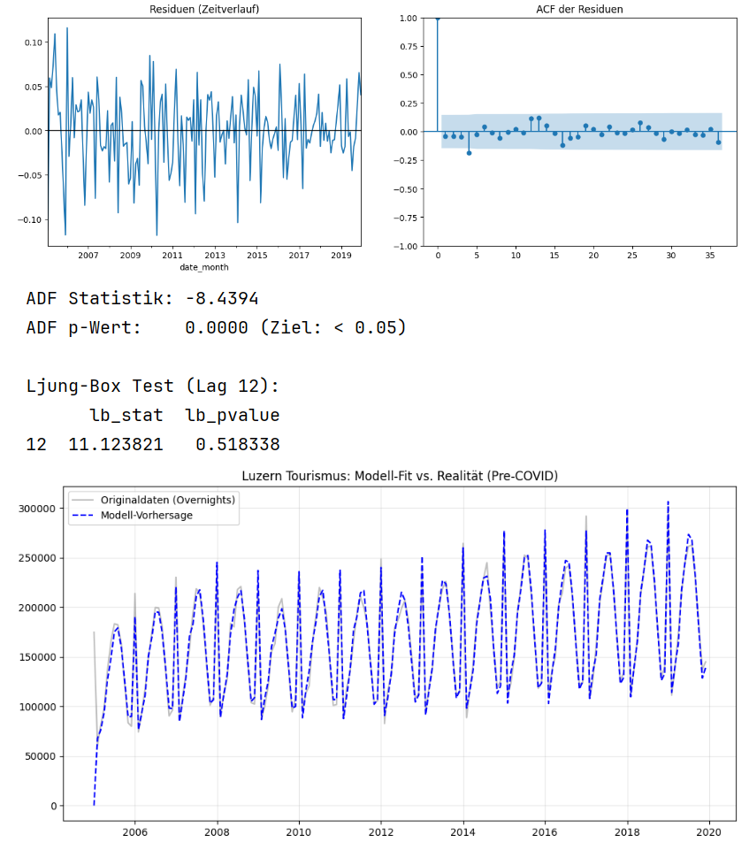{width=90%}
</Center>
<br>
The diagnostics indicate a good fit for the SARIMA model: the residuals are stationary and randomly distributed around zero, with no significant autocorrelation (ADF p < 0.001; Ljung–Box p = 0.52). The model closely tracks the number of overnight tourist stays, accurately capturing both seasonal cycles and long-term trends. This indicates strong statistical reliability and explanatory power.


<details>
<summary><strong> SARIMA Code with Covid as a Dummy Variable (IDAweb) </strong></summary>

```python
import warnings
warnings.filterwarnings("ignore")

import pandas as pd
import numpy as np
import matplotlib.pyplot as plt
from statsmodels.tsa.statespace.sarimax import SARIMAX
from statsmodels.tsa.stattools import adfuller

# ============================================================
# 1) DATEN LADEN & GLOBALE VORBEREITUNG
# ============================================================
PATH = "/content/drive/MyDrive/Sustainability Analytics/Lucerne_Tourism_Climate_Monthly_Merged.csv"
df = pd.read_csv(PATH)
df["date_month"] = pd.to_datetime(df["date_month"])
df = df.sort_values("date_month").set_index("date_month").asfreq("MS")
df = df.interpolate(method='linear')

# Klima-Anomalien basierend auf den stabilen Pre-COVID Jahren (2005-2019)
# Das ist methodisch sauberer, um "Normalität" zu definieren.
pre_2020_data = df.loc[df.index < '2020-01-01']
monthly_avg_pre = pre_2020_data.groupby(pre_2020_data.index.month)['temp_mean_C'].mean()
df['month_idx'] = df.index.month
df['temp_anomaly'] = df.apply(lambda r: r['temp_mean_C'] - monthly_avg_pre[r['month_idx']], axis=1)

# Basis-Features (Log-Target, Monats-Dummies, Klima, Trend)
y_full = np.log1p(df["overnights"])
X_base = pd.get_dummies(df.index.month, prefix='m', drop_first=True).astype(float)
X_base.index = df.index
X_base['temp_anomaly'] = df['temp_anomaly']
X_base['precip_sum_mm'] = df['precip_sum_mm']
t = np.arange(len(df))
X_base['trend'] = t
X_base['trend2'] = t**2

# ============================================================
# MODELL 1: PRE-COVID (BIS 12/2019)
# ============================================================
cutoff_date = "2019-12-01"
y1 = y_full.loc[y_full.index <= cutoff_date]
X1 = X_base.loc[X_base.index <= cutoff_date]

# SARIMAX(1,1,1) sorgt für Stationarität (ADF p-Wert sinkt)
model1 = SARIMAX(y1, exog=X1, order=(1, 1, 1), seasonal_order=(0, 0, 0, 12), enforce_stationarity=False)
res1 = model1.fit(disp=False, maxiter=500)

# ============================================================
# MODELL 2: GESAMTZEITRAUM (BIS 2024 INKL. COVID-DUMMY)
# ============================================================
X2 = X_base.copy()
X2['covid_shock'] = 0
# Wir markieren die Hauptphase des Schocks (März 2020 bis Juni 2021)
X2.loc['2020-03-01':'2021-06-01', 'covid_shock'] = 1

model2 = SARIMAX(y_full, exog=X2, order=(1, 1, 1), seasonal_order=(0, 0, 0, 12), enforce_stationarity=False)
res2 = model2.fit(disp=False, maxiter=500)

# ============================================================
# ERGEBNISSE & VERGLEICH
# ============================================================
print("\n" + "="*50)
print("ERGEBNIS MODELL 1 (PRE-COVID)")
print("="*50)
print(res1.summary().tables[1])
print(f"ADF p-Wert (Residuen): {adfuller(res1.resid.iloc[1:])[1]:.4f}")

print("\n" + "="*50)
print("ERGEBNIS MODELL 2 (FULL INKL. COVID)")
print("="*50)
print(res2.summary().tables[1])
print(f"ADF p-Wert (Residuen): {adfuller(res2.resid.iloc[1:])[1]:.4f}")

# Visualisierung des Vergleichs
plt.figure(figsize=(15, 10))

# Plot 1: Fit Modell 1
plt.subplot(2, 1, 1)
plt.plot(np.expm1(y1), label="Original (Pre-COVID)", color="gray", alpha=0.5)
plt.plot(np.expm1(res1.fittedvalues), label="Modell 1 Fit", color="blue", linestyle="--")
plt.title("Modell 1: Analyse der stabilen Phase (2005-2019)")
plt.legend()
plt.grid(True, alpha=0.3)


# Plot 2: Fit Modell 2
plt.subplot(2, 1, 2)

# Wir überspringen die ersten 12 Monate ([12:]), um den Initialisierungs-Effekt auszublenden
plt.plot(np.expm1(y_full[12:]), label="Original (Gesamtzeitraum)", color="gray", alpha=0.5)
plt.plot(np.expm1(res2.fittedvalues[12:]), label="Modell 2 Fit", color="red", linestyle="--")

plt.title("Modell 2: Gesamtanalyse mit COVID-Dummy (2005-2024) - Start ab 2006")
plt.legend()
plt.grid(True, alpha=0.3)

plt.tight_layout()
plt.show()

```
</details>

<br>
<Center>
{width=90%}
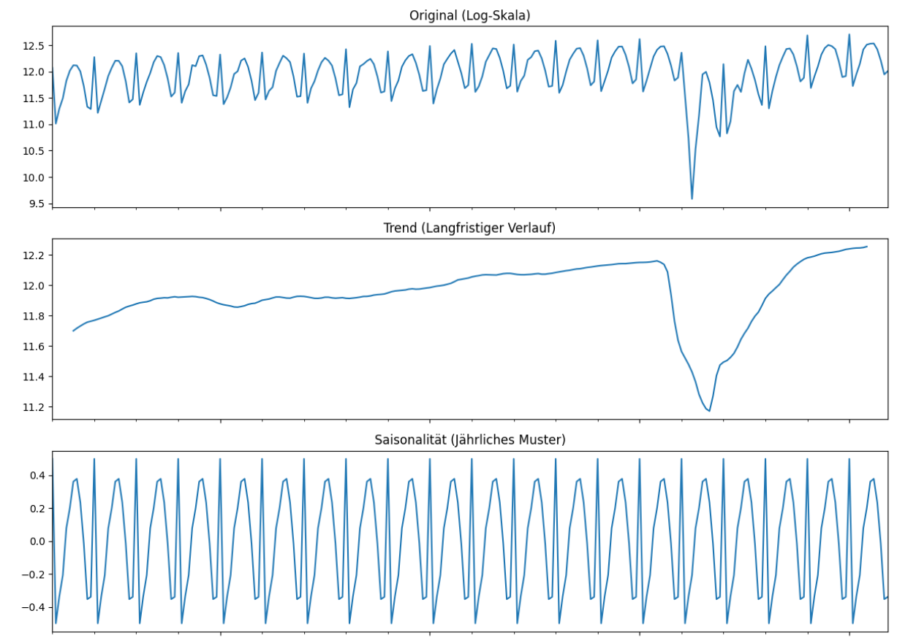{width=90%}
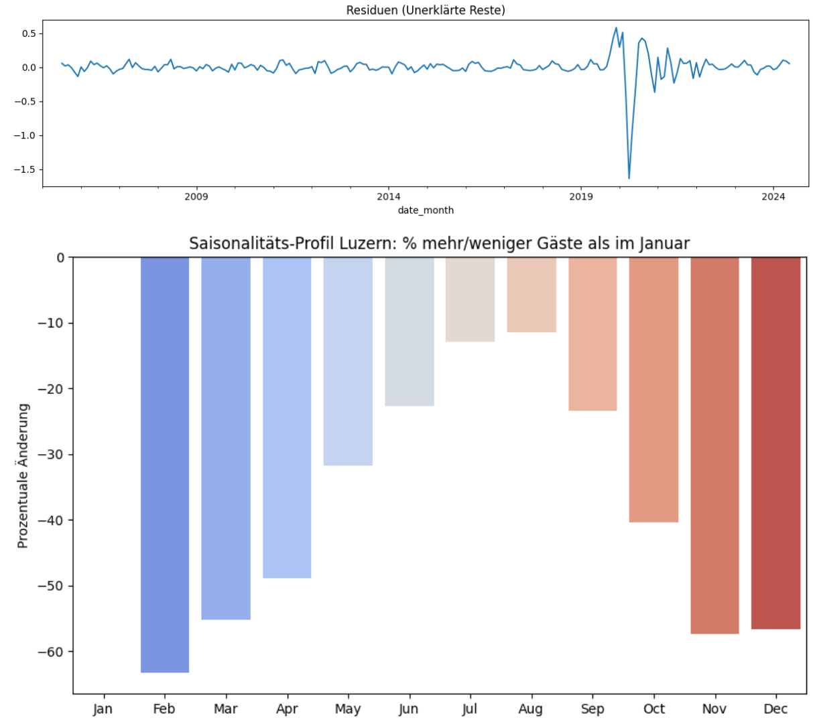{width=90%}
{width=90%}
</Center>
<br>
The SARIMA analysis reveals a highly stable and predictable seasonal pattern in alpine tourism, with consistent peaks in summer and significantly fewer visitors in winter. This strong seasonality persisted throughout the study period; however, the abrupt collapse in guest arrivals during the years of the pandemic demonstrates how external shocks can disrupt even well-established tourism systems. The model's incorporation of a 'Covid' dummy variable effectively captures this structural shift, emphasising the severity of the disruption and the subsequent recovery. These empirical patterns emphasise the vulnerability of alpine destinations, where tourism performance is closely linked to environmental conditions. Reduced snow reliability, shorter winter seasons and increasing weather variability  key consequences of climate change  pose significant risks for regions that rely heavily on winter tourism as a primary economic driver. The combination of strong seasonal dependence and high economic concentration amplifies exposure to climate-related shocks, making long-term resilience and diversification essential.

<br>

### **SARIMAX**
To verify the robustness of our results we also elaborated a  SARIMAX model by introducing external explanatory variables. While a SARIMA model captures the internal structure of a time series, a SARIMAX model allows us to test whether observed patterns persist when external shocks, such as the 'Covid dummy', are explicitly included. This re-estimation serves as a consistency check, confirming that our main conclusions remain stable when accounting for exogenous influences.

<details>
<summary><strong>SARIMAX r data input </strong></summary>

```r
library(tidyverse)
library(lubridate)
library(forecast)

df <- read_csv("Lucerne_Tourism_Climate_Monthly_Merged.csv", show_col_types = FALSE) %>%
  mutate(date_month = as.Date(date_month)) %>%
  arrange(date_month)

covid_start <- as.Date("2020-03-01")
covid_end   <- as.Date("2021-06-01")

df <- df %>%
  mutate(covid_dummy = if_else(date_month >= covid_start & date_month <= covid_end, 1, 0))

y <- ts(log1p(df$overnights),
        start=c(year(min(df$date_month)), month(min(df$date_month))),
        frequency=12)

X <- as.matrix(df %>% select(temp_mean_C, precip_sum_mm, covid_dummy))

ibrary(forecast)

# ---- sanity checks ----
stopifnot(is.ts(y))
stopifnot(frequency(y) == 12)

stopifnot(is.matrix(X))
stopifnot(nrow(X) == length(y))

# Optional but recommended for stability in SARIMAX:
X <- scale(X)

# ---- backtest settings ----
W <- 84   # training window length (months)
h <- 3    # forecast horizon
step <- 1 # step size between folds

n <- length(y)

# fold endpoints (indices of last training observation)
fold_ends <- seq(W, n - h, by = step)

length(fold_ends)

head(fold_ends); tail(fold_ends)

metrics <- function(actual, pred){
  actual <- as.numeric(actual)
  pred   <- as.numeric(pred)

  tibble(
    RMSE = sqrt(mean((actual - pred)^2, na.rm=TRUE)),
    MAE  = mean(abs(actual - pred), na.rm=TRUE),
    MAPE = mean(abs((actual - pred) / actual), na.rm=TRUE) * 100
  )
}

k <- 1  # test the first fold
end_train <- fold_ends[k]
start_train <- end_train - W + 1

# Check index ranges are valid
stopifnot(start_train >= 1)
stopifnot(end_train + h <= n)

# Use INDEX slicing (more robust than window(time(y)[...]) in many cases)
y_tr <- ts(y[start_train:end_train], frequency=12)
y_te <- y[(end_train+1):(end_train+h)]

X_tr <- X[start_train:end_train, , drop=FALSE]
X_te <- X[(end_train+1):(end_train+h), , drop=FALSE]

dim(X_tr); dim(X_te)
length(y_tr); length(y_te)

# Fit baseline SARIMA quickly (you can change order later)
m_sarima <- Arima(y_tr, order=c(0,1,1), seasonal=list(order=c(0,1,1), period=12), method="ML")
f_sarima <- forecast(m_sarima, h=h)$mean

# Fit SARIMAX
m_sarimax <- Arima(y_tr, order=c(0,1,1), seasonal=list(order=c(0,1,1), period=12),
                   xreg=X_tr, method="ML")

```
</details>
single-fold This chunk:
scales X using training mean/sd drops constant columns tries ML, then CSS-ML if still fails, falls back to a simpler seasonal model

<details>
<summary><strong>SARIMAX baseline input</strong></summary>

```r
library(forecast)

k <- 1
end_train <- fold_ends[k]
start_train <- end_train - W + 1

y_tr <- ts(y[start_train:end_train], frequency=12)
y_te <- y[(end_train+1):(end_train+h)]

X_tr_raw <- X[start_train:end_train, , drop=FALSE]
X_te_raw <- X[(end_train+1):(end_train+h), , drop=FALSE]

# ---- 1) Drop constant columns in this fold (e.g., covid all zeros) ----
is_const <- apply(X_tr_raw, 2, function(z) sd(z, na.rm=TRUE) == 0)
X_tr_raw <- X_tr_raw[, !is_const, drop=FALSE]
X_te_raw <- X_te_raw[, !is_const, drop=FALSE]

# ---- 2) Scale using TRAIN stats only (avoid leakage) ----
mu <- colMeans(X_tr_raw, na.rm=TRUE)
sdv <- apply(X_tr_raw, 2, sd, na.rm=TRUE)
sdv[sdv == 0] <- 1  # just in case

X_tr <- scale(X_tr_raw, center=mu, scale=sdv)
X_te <- scale(X_te_raw, center=mu, scale=sdv)

# ---- 3) Fit SARIMA baseline (should work) ----
m_sarima <- Arima(y_tr,
                  order=c(0,1,1),
                  seasonal=list(order=c(0,1,1), period=12),
                  method="ML")
f_sarima <- forecast(m_sarima, h=h)$mean

metrics(y_te, f_sarima)

```
</details>
<br>
<Center>
{width=90%}
</Center>
<br>

<details>
<summary><strong>SARIMAX attempt</strong></summary>

```r

# ---- 4) Fit SARIMAX robustly (try ML -> CSS-ML -> fallback model) ----
fit_try <- function(method_name, seas_order){
  Arima(y_tr,
        order=c(0,1,1),
        seasonal=list(order=seas_order, period=12),
        xreg=X_tr,
        method=method_name)
}

m_sarimax <- try(fit_try("ML", c(0,1,1)), silent=TRUE)

if(inherits(m_sarimax, "try-error")){
  m_sarimax <- try(fit_try("CSS-ML", c(0,1,1)), silent=TRUE)
}

# fallback: simpler seasonal component
if(inherits(m_sarimax, "try-error")){
  m_sarimax <- try(fit_try("ML", c(0,1,0)), silent=TRUE)
}

if(inherits(m_sarimax, "try-error")){
  m_sarimax <- try(fit_try("CSS-ML", c(0,1,0)), silent=TRUE)
}

# if still failing, print message
if(inherits(m_sarimax, "try-error")){
  stop("SARIMAX failed even after ML/CSS-ML and simpler seasonal order. Try larger W or simpler orders.")
}

f_sarimax <- forecast(m_sarimax, xreg=X_te, h=h)$mean
metrics(y_te, f_sarimax)

```
</details>

</details>
<br>
<Center>
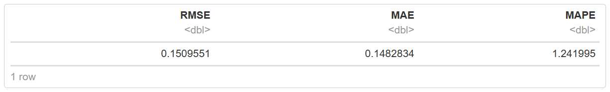{width=90%}
</Center>
<br>

<details>
<summary><strong>SARIMAX Cross-Validation Loop</strong></summary>

```r
library(forecast)

# ----------------------------
# 0) Pick fold and slice SAME data
# ----------------------------
k <- 1
end_train <- fold_ends[k]
start_train <- end_train - W + 1

y_tr <- ts(y[start_train:end_train], frequency=12)
y_te <- y[(end_train+1):(end_train+h)]

# ----------------------------
# 1) Fit SARIMA on y_tr
# ----------------------------
m_sarima <- Arima(
  y_tr,
  order=c(0,1,1),
  seasonal=list(order=c(0,1,1), period=12),
  method="ML"
)

# ----------------------------
# 2) Print model summary (this is the output you asked for)
# ----------------------------
cat("\n================ SARIMA SUMMARY (same window) ================\n")
print(summary(m_sarima))

```
</details>

<br>
<Center>
{width=90%}
</Center>
<br>

<details>
<summary><strong> Rolling backtest loop ( SARIMA + SARIMAX) </strong></summary>

```r
library(tidyverse)
library(forecast)

# --- robust SARIMAX fitter (same as before) ---
fit_sarimax_robust <- function(y_tr, X_tr){
  attempt <- function(method_name, seas_order){
    Arima(y_tr,
          order=c(0,1,1),
          seasonal=list(order=seas_order, period=12),
          xreg=X_tr,
          method=method_name)
  }

  m <- try(attempt("ML", c(0,1,1)), silent=TRUE)
  if(!inherits(m, "try-error")) return(m)

  m <- try(attempt("CSS-ML", c(0,1,1)), silent=TRUE)
  if(!inherits(m, "try-error")) return(m)

  # fallback seasonal: (0,1,0)
  m <- try(attempt("ML", c(0,1,0)), silent=TRUE)
  if(!inherits(m, "try-error")) return(m)

  m <- try(attempt("CSS-ML", c(0,1,0)), silent=TRUE)
  if(!inherits(m, "try-error")) return(m)

  stop("SARIMAX fit failed.")
}

res <- vector("list", length(fold_ends))

for(k in seq_along(fold_ends)){
  end_train <- fold_ends[k]
  start_train <- end_train - W + 1
  if(start_train < 1) next
  if(end_train + h > n) next

  # --- slice target ---
  y_tr <- ts(y[start_train:end_train], frequency=12)
  y_te <- y[(end_train+1):(end_train+h)]

  # --- slice xreg ---
  X_tr_raw <- X[start_train:end_train, , drop=FALSE]
  X_te_raw <- X[(end_train+1):(end_train+h), , drop=FALSE]

  # drop constant columns
  is_const <- apply(X_tr_raw, 2, function(z) sd(z, na.rm=TRUE) == 0)
  X_tr_raw <- X_tr_raw[, !is_const, drop=FALSE]
  X_te_raw <- X_te_raw[, !is_const, drop=FALSE]

  # scale using TRAIN stats only
  mu <- colMeans(X_tr_raw, na.rm=TRUE)
  sdv <- apply(X_tr_raw, 2, sd, na.rm=TRUE)
  sdv[sdv == 0] <- 1

  X_tr <- scale(X_tr_raw, center=mu, scale=sdv)
  X_te <- scale(X_te_raw, center=mu, scale=sdv)

  # ---- SARIMA baseline ----
  m_sarima <- Arima(y_tr,
                    order=c(0,1,1),
                    seasonal=list(order=c(0,1,1), period=12),
                    method="ML")
  f_sarima <- forecast(m_sarima, h=h)$mean

  # ---- SARIMAX (robust) ----
  sarimax_failed <- FALSE
  f_sarimax <- rep(NA_real_, h)

  m_sarimax <- try(fit_sarimax_robust(y_tr, X_tr), silent=TRUE)

  if(inherits(m_sarimax, "try-error")){
    sarimax_failed <- TRUE
  } else {
    fc_x <- try(forecast(m_sarimax, xreg=X_te, h=h), silent=TRUE)

    if(inherits(fc_x, "try-error")) {
      sarimax_failed <- TRUE
    } else {
      f_sarimax <- as.numeric(fc_x$mean)

      # If mean forecast not finite -> treat as failed
      if(any(!is.finite(f_sarimax))) sarimax_failed <- TRUE
    }
  }

  # If SARIMAX failed, fallback to SARIMA mean for metrics (so no NaN)
  if(sarimax_failed){
    f_sarimax <- as.numeric(f_sarima)
  }

  res[[k]] <- bind_rows(
    metrics(y_te, f_sarima)  %>% mutate(model="SARIMA"),
    metrics(y_te, f_sarimax) %>% mutate(model="SARIMAX", sarimax_failed=sarimax_failed)
  ) %>% mutate(fold=k)
}

bt <- bind_rows(res)

# --- how often SARIMAX failed ---
fail_rate <- bt %>%
  filter(model=="SARIMAX") %>%
  summarise(
    folds = n(),
    failed = sum(sarimax_failed, na.rm=TRUE),
    fail_rate = failed / folds
  )

fail_rate

```
</details>

<br>
<Center>
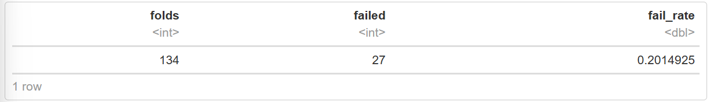{width=90%}
</Center>
<br>

<details>
<summary><strong> Average metrics </strong></summary>

```r
# --- average metrics (note: SARIMAX includes fallback-on-fail folds) ---
bt_summary <- bt %>%
  group_by(model) %>%
  summarise(across(c(RMSE, MAE, MAPE), mean), .groups="drop")

bt_summary

```
</details>

<br>
<Center>
{width=90%}
</Center>
<br>

<details>
<summary><strong> Plotting SARIMAX </strong></summary>

```r
library(ggplot2)

# RMSE over time
bt %>%
  ggplot(aes(fold, RMSE, color=model)) +
  geom_line() +
  geom_point(size=1) +
  theme_minimal() +
  labs(title=paste0("Rolling backtest RMSE (W=",W,", h=",h,")"),
       x="Fold", y="RMSE (log1p scale)")

```
</details>

<br>
<Center>
{width=90%}
</Center>
<br>

<details>
<summary><strong> Plotting SARIMA vrs SARIMAX analisys </strong></summary>

```r

# Boxplot comparison (nice for presentation)
bt %>%
  ggplot(aes(model, RMSE)) +
  geom_boxplot() +
  theme_minimal() +
  labs(title="RMSE distribution across folds (lower is better)",
       x="", y="RMSE (log1p scale)")
stl_fit <- stl(y, s.window="periodic")
autoplot(stl_fit)


```
</details>

<br>
<Center>
{width=90%}
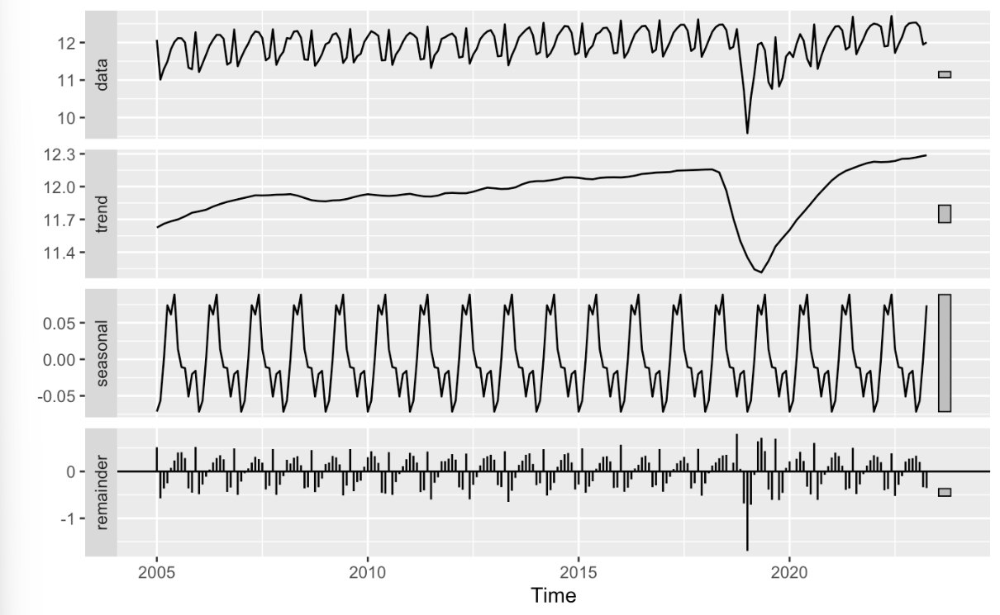{width=90%}
</Center>
<br>

Together, these two visualisations demonstrate how well the models perform and the structure they are attempting to learn. The RMSE boxplot shows that SARIMAX generally achieves lower prediction errors than SARIMA when using cross-validation folds, suggesting that incorporating climate variables increases accuracy, despite slightly larger variability across folds. The decomposition plot reveals why forecasting is challenging: the series contains a strong seasonal cycle, a long-term upward trend and a significant disruption around 2020. The models must capture all of these features. Overall, the figures show that SARIMAX handles these structural patterns more effectively, resulting in better predictive performance.


<details>
<summary><strong> Plotting LOG of overnight stays </strong></summary>

```r
par(mfrow=c(1,2))
acf(y, main="ACF of log overnight stays")
pacf(y, main="PACF of log overnight stays")
par(mfrow=c(1,1))

```
</details>

<br>
<Center>
{width=90%}
</Center>
<br>

<details>
<summary><strong> Plotting Regression analisys </strong></summary>

```r
fit_final <- Arima(y,
                   order=c(0,1,1),
                   seasonal=list(order=c(0,1,1), period=12),
                   xreg=scale(X))

checkresiduals(fit_final)

```
</details>

<br>
<Center>
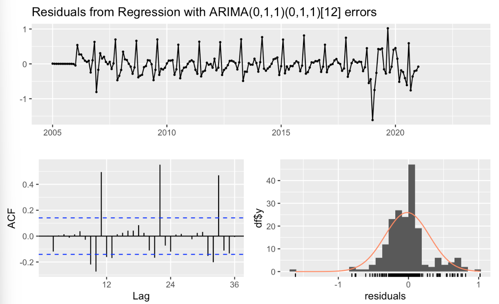{width=90%}
</Center>
<br>

<details>
<summary><strong> Plotting forecast SARIMAX </strong></summary>

```r
fc <- forecast(fit_final, xreg=scale(X), h=12)

autoplot(fc) +
  autolayer(y, series="Actual") +
  labs(title="SARIMAX fit on full data")

# STL
autoplot(stl(y, s.window="periodic"))
# ACF/PACF original
acf(y)
pacf(y)

```
</details>

<br>
<Center>
{width=90%}
{width=90%}
{width=90%}
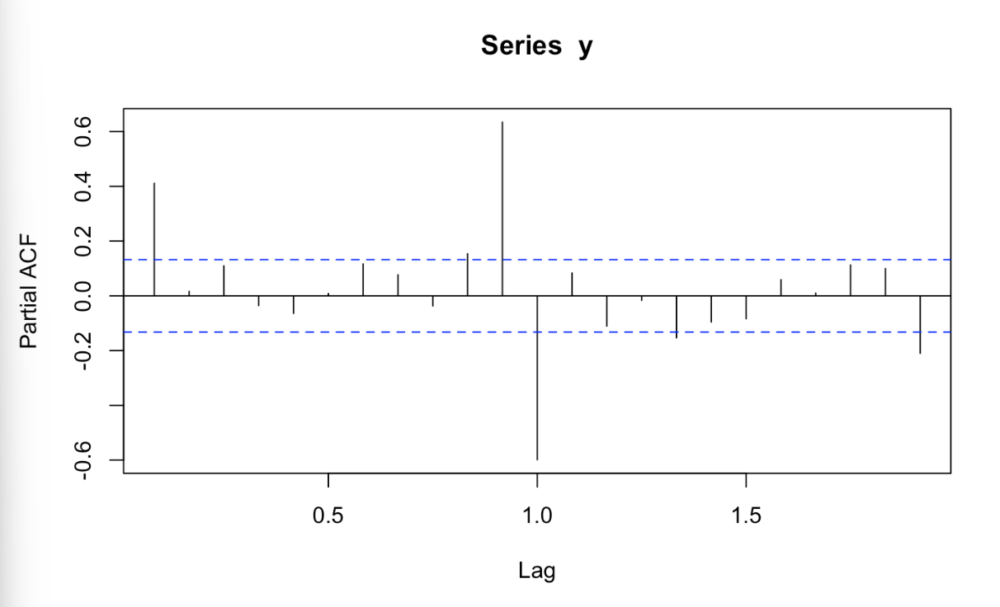{width=90%}
</Center>
<br>

This set of diagnostics shows how well the SARIMAX model fits the full time series, and whether its assumptions are valid. The top plot compares the historical data with the fitted values and long-term forecast of the model, showing that SARIMAX captures both the seasonal fluctuations and the overall upward trend. The decomposition panel below separates the series into trend, seasonal and residual components, confirming the presence of strong yearly seasonality and a smooth long-term trend that the model must capture. Finally, the ACF and PACF of the residuals help to assess whether any structure remains unexplained. The mostly low and scattered correlations suggest that the model has removed most predictable patterns, leaving residuals that behave similarly to white noise. Together, these visualisations suggest that the SARIMAX model provides a reasonable fit and that its assumptions are generally met.


<details>
<summary><strong> Plotting residual diagnostic SARIMAX </strong></summary>

```r
# Residual diagnostics SARIMAX
checkresiduals(fit_final)

```
</details>

<br>
<Center>
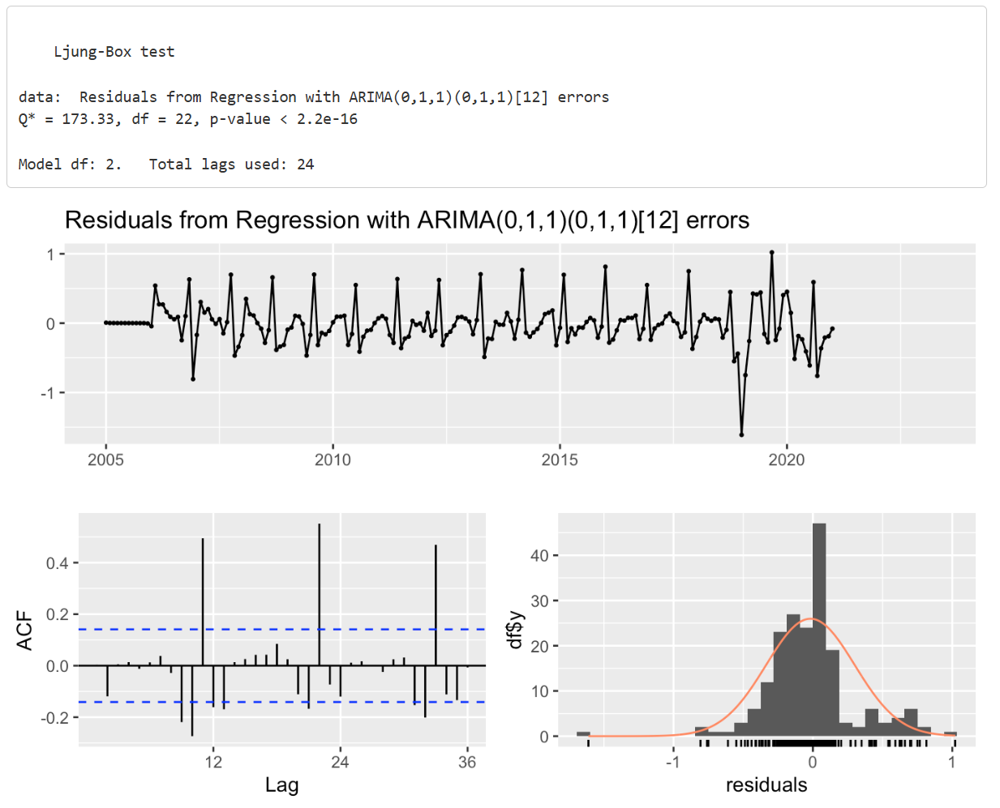{width=90%}
</Center>
<br>


<details>
<summary><strong> Plotting residual diagnostic SARIMAX </strong></summary>

```r
# Actual vs fitted
autoplot(fitted(fit_final)) + autolayer(y)

```
</details>

<br>
<Center>
{width=90%}
</Center>
<br>

This plot compares the actual series with the fitted values from the model to provide a visual assessment of how well SARIMAX captures the underlying pattern. The fitted line closely tracks the observed data, suggesting that the model successfully reproduces the main seasonal and trend dynamics, with only minor residual noise remaining.

<details>
<summary><strong> Plotting Climate vs Tourism </strong></summary>

```r

# Climate vs tourism
df %>%
  ggplot(aes(temp_mean_C, expm1(y))) +
  geom_point(alpha=.4) +
  geom_smooth()
```
</details>

<br>
<Center>
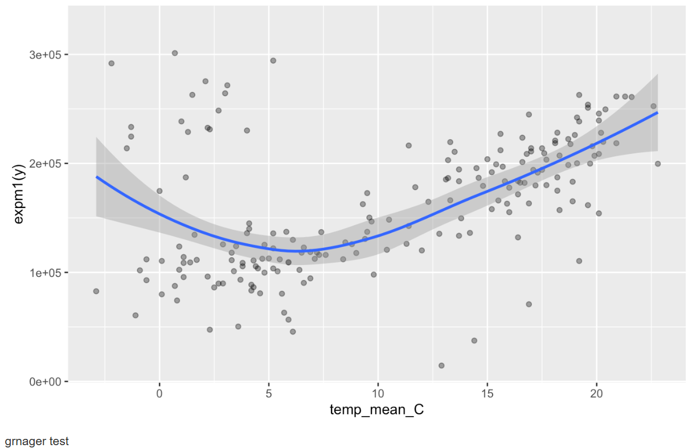{width=90%}
</Center>
<br>

This scatter plot illustrates the relationship between temperature and tourism expenditure, revealing a clear non-linear pattern. The smooth curve indicates that tourism spending increases at the extremes of the temperature range, while moderate temperatures correspond to lower expenditure. This highlights the complex relationship between climate and tourism.

<details>
<summary><strong> Granger test </strong></summary>

```r

library(lmtest)

y_log <- log1p(df$overnights)
temp <- df$temp_mean_C
prec <- df$precip_sum_mm

# Seasonal difference (12) for monthly series
dy <- diff(y_log, lag=12)
dtemp <- diff(temp, lag=12)
dprec <- diff(prec, lag=12)

# Optional: also regular difference after seasonal differencing
# dy <- diff(dy, lag=1)
# dtemp <- diff(dtemp, lag=1)
# dprec <- diff(dprec, lag=1)

# Align (diff reduces length)
dat_g <- na.omit(data.frame(dy=dy, dtemp=dtemp, dprec=dprec))

# Choose lags (try 1..6 months; keep small)
# H0: temp does NOT Granger-cause dy
grangertest(dy ~ dtemp, order=3, data=dat_g)
grangertest(dy ~ dprec, order=3, data=dat_g)
```
</details>

<br>
<Center>
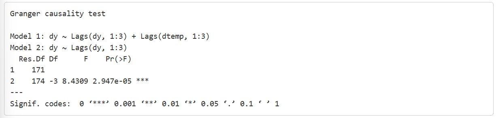{width=90%}
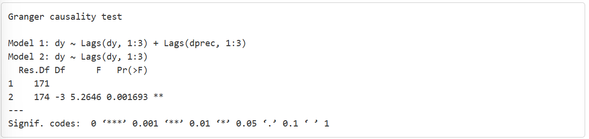{width=90%}
</Center>
<br>


<details>
<summary><strong> SARIMAX 10 year forecast </strong></summary>

```r
library(dplyr)
library(lubridate)
library(forecast)
library(ggplot2)

# df must contain: date_month, overnights, temp_mean_C, precip_sum_mm, covid_dummy
# y must be the ts(log1p(overnights)) used to fit fit_final

# ----------------------------
# 1) Training regressors + scaling info
# ----------------------------
X_train <- as.matrix(df %>% select(temp_mean_C, precip_sum_mm, covid_dummy))
X_train_sc <- scale(X_train)

X_center <- attr(X_train_sc, "scaled:center")
X_scale  <- attr(X_train_sc, "scaled:scale")

# If you did NOT fit fit_final using X_train_sc, refit it now:
# fit_final <- Arima(y,
#                    order=c(0,1,1),
#                    seasonal=list(order=c(0,1,1), period=12),
#                    xreg=X_train_sc,
#                    method="ML")

# ----------------------------
# 2) Create 10-year future dates
# ----------------------------
h <- 120  # 10 years monthly
last_date <- max(df$date_month)
future_dates <- seq(last_date %m+% months(1), by="month", length.out=h)
future_months <- month(future_dates)

# ----------------------------
# 3) Baseline climate = monthly climatology (no future data needed)
# ----------------------------
temp_clim <- tapply(df$temp_mean_C, month(df$date_month), mean, na.rm=TRUE)
prec_clim <- tapply(df$precip_sum_mm, month(df$date_month), mean, na.rm=TRUE)

X_future_base <- cbind(
  temp_mean_C   = as.numeric(temp_clim[future_months]),
  precip_sum_mm = as.numeric(prec_clim[future_months]),
  covid_dummy   = rep(0, h)
)

colnames(X_future_base) <- colnames(X_train)

# ----------------------------
# 4) +2°C scenario
# ----------------------------
X_future_plus2 <- X_future_base
X_future_plus2[, "temp_mean_C"] <- X_future_plus2[, "temp_mean_C"] + 2

# ----------------------------
# 5) Scale future X using TRAIN scaling
# ----------------------------
X_future_plus2_sc <- scale(X_future_plus2, center=X_center, scale=X_scale)

# ----------------------------
# 6) Forecast 10 years ahead under +2°C
# ----------------------------
fc_plus2_10y <- forecast(fit_final, xreg=X_future_plus2_sc, h=h)

# ----------------------------
# 7) Plot on log scale (same style as your original)
# ----------------------------
autoplot(fc_plus2_10y, series="+2°C scenario (10y)") +
  autolayer(y, series="Actual") +
  labs(
    title="SARIMAX forecast for next 10 years under +2°C warming (climatology baseline)",
    x="Time",
    y="y = log1p(overnight stays)"
  ) +
  guides(colour=guide_legend(title="Series"))

```
</details>

<br>
<Center>
{width=90%}
</Center>
<br>

This graph illustrates the expected evolution of power demand over the next decade, assuming a +2°C increase in temperature compared to the historical baseline. The SARIMAX model captures the strong seasonal pattern in the historical data and uses this to make projections, showing that even with a warmer climate, the overall seasonal rhythm will remain stable. The forecasted values remain close to the historical trend, indicating that long-term demand dynamics are not drastically altered by a simple uniform warming shift, although the model still reflects natural seasonal peaks and troughs.

<details>
<summary><strong> SARIMAX 10 year baseline vs warming ramp </strong></summary>

```r
h <- 120
ramp <- seq(0, 2, length.out=h)  # 0°C now → +2°C in 10 years

X_future_ramp2 <- X_future_base
X_future_ramp2[, "temp_mean_C"] <- X_future_ramp2[, "temp_mean_C"] + ramp

X_future_ramp2_sc <- scale(X_future_ramp2, center=X_center, scale=X_scale)

fc_ramp2 <- forecast(fit_final, xreg=X_future_ramp2_sc, h=h)

autoplot(fc_base, series="Baseline") +
  autolayer(fc_ramp2$mean, series="Warming ramp to +2°C") +
  autolayer(y, series="Actual") +
  labs(title="SARIMAX: baseline vs warming ramp (10 years)",
       y="y = log1p(overnights)", x="Time") +
  guides(colour=guide_legend(title="Series"))

```
</details>

<br>
<Center>
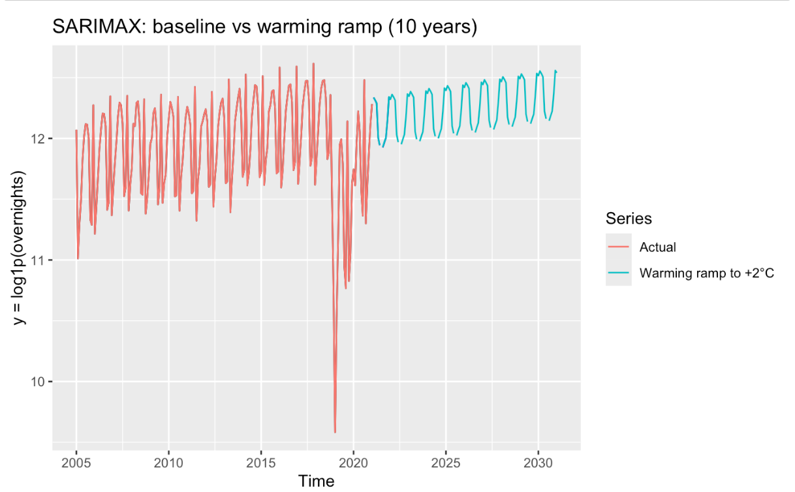{width=90%}
</Center>
<br>

This graph compares the historical baseline with a scenario in which temperatures gradually increase towards +2°C over the next ten years. Unlike the flat warming scenario, the ramp introduces a progressive climate signal into the model, causing a slight shift in the forecasted demand pattern over time. The cyan forecast line shows how power demand gradually diverges from the baseline as warming accumulates. This illustrates that gradual climate change can subtly reshape future consumption patterns, even when the seasonal structure remains intact.

<details>
<summary><strong> SARIMAX Test metrics </strong></summary>

```r
# ============================
# CHUNK 1 — SARIMA (baseline) on SAME fold/window
# ============================

# Assumes you already defined: y, fold_ends, W, h, metrics()

k <- 1
end_train <- fold_ends[k]
start_train <- end_train - W + 1

y_tr <- ts(y[start_train:end_train], frequency=12)
y_te <- y[(end_train+1):(end_train+h)]

# Fit SARIMA
m_sarima <- Arima(
  y_tr,
  order=c(0,1,1),
  seasonal=list(order=c(0,1,1), period=12),
  method="ML"
)

cat("\n================ SARIMA SUMMARY ================\n")

================ SARIMA SUMMARY ================
print(summary(m_sarima))
Series: y_tr
ARIMA(0,1,1)(0,1,1)[12]

Coefficients:
          ma1     sma1
      -1.0000  -0.5549
s.e.   0.0642   0.1554

sigma^2 = 0.1715:  log likelihood = -42.03
AIC=90.06   AICc=90.41   BIC=96.84

Training set error measures:
                      ME      RMSE       MAE
Training set -0.01931404 0.3753098 0.2732517
                    MPE    MAPE      MASE       ACF1
Training set -0.2191661 2.31647 0.8019199 0.01697187
cat("\n================ SARIMA IC (same window) ================\n")

================ SARIMA IC (same window) ================
print(data.frame(
  model="SARIMA",
  AIC=AIC(m_sarima),
  AICc=MuMIn::AICc(m_sarima),
  BIC=BIC(m_sarima)
))
   model      AIC     AICc      BIC
1 SARIMA 90.05604 90.41425 96.84408
# Forecast and metrics on SAME test horizon
fc_sarima <- forecast(m_sarima, h=h)
f_sarima <- as.numeric(fc_sarima$mean)

cat("\n================ SARIMA TEST METRICS (same horizon) ================\n")

================ SARIMA TEST METRICS (same horizon) ================
print(metrics(y_te, f_sarima))
# A tibble: 1 × 3
   RMSE   MAE  MAPE
  <dbl> <dbl> <dbl>
1 0.609 0.457  3.96
# Optional residual diagnostics
# checkresiduals(m_sarima)
# ============================
# CHUNK 2 (FIXED) — SARIMAX on SAME fold/window (robust + fallback)
# ============================

library(forecast)

k <- 1
end_train <- fold_ends[k]
start_train <- end_train - W + 1

y_tr <- ts(y[start_train:end_train], frequency=12)
y_te <- y[(end_train+1):(end_train+h)]

X_tr_raw <- X[start_train:end_train, , drop=FALSE]
X_te_raw <- X[(end_train+1):(end_train+h), , drop=FALSE]

# 1) Drop constant columns in THIS fold
is_const <- apply(X_tr_raw, 2, function(z) sd(z, na.rm=TRUE) == 0)
X_tr_raw <- X_tr_raw[, !is_const, drop=FALSE]
X_te_raw <- X_te_raw[, !is_const, drop=FALSE]

# 2) Scale using TRAIN stats only
mu <- colMeans(X_tr_raw, na.rm=TRUE)
sdv <- apply(X_tr_raw, 2, sd, na.rm=TRUE)
sdv[sdv == 0] <- 1

X_tr <- scale(X_tr_raw, center=mu, scale=sdv)
X_te <- scale(X_te_raw, center=mu, scale=sdv)

# ---- Helper: safe fit with extra stability knobs ----
safe_fit <- function(order, seas, method_name){
  Arima(
    y_tr,
    order=order,
    seasonal=list(order=seas, period=12),
    xreg=X_tr,
    method=method_name,
    include.mean=FALSE,      # good practice with d/D differencing
    transform.pars=TRUE      # enforce stationarity/invertibility transforms
  )
}

# ---- Try a grid of models *and* methods ----
candidates <- list(
  list(order=c(0,1,1), seas=c(0,1,1)),
  list(order=c(0,1,1), seas=c(1,1,1)),
  list(order=c(1,1,1), seas=c(0,1,1)),
  list(order=c(0,1,1), seas=c(1,1,0)),
  list(order=c(1,1,0), seas=c(1,1,0))
)
methods <- c("ML", "CSS-ML")

m_sarimax <- NULL
f_sarimax <- rep(NA_real_, h)
chosen <- NULL
sarimax_failed <- TRUE

for(spec in candidates){
  for(meth in methods){

    m_try <- try(safe_fit(spec$order, spec$seas, meth), silent=TRUE)
    if(inherits(m_try, "try-error")) next

    # Forecast mean only (intervals sometimes explode)
    fc_try <- try(suppressWarnings(forecast(m_try, xreg=X_te, h=h)), silent=TRUE)
    if(inherits(fc_try, "try-error")) next

    f_try <- as.numeric(fc_try$mean)
    if(any(!is.finite(f_try))) next

    # success
    m_sarimax <- m_try
    f_sarimax <- f_try
    chosen <- list(order=spec$order, seas=spec$seas, method=meth)
    sarimax_failed <- FALSE
    break
  }
  if(!sarimax_failed) break
}

# ---- If still failed: do NOT crash; fallback to SARIMA baseline for this fold ----
if(sarimax_failed){
  message("⚠️ SARIMAX unstable in this fold -> falling back to SARIMA mean forecast for metrics.")
  # If you already computed f_sarima in SARIMA chunk, reuse it.
  # Otherwise compute quickly here:
  m_sarima <- Arima(
    y_tr,
    order=c(0,1,1),
    seasonal=list(order=c(0,1,1), period=12),
    method="ML"
  )
  f_sarimax <- as.numeric(forecast(m_sarima, h=h)$mean)
} else {
  cat("\nChosen SARIMAX spec:\n")
  print(chosen)
  cat("\nSARIMAX summary:\n")
  print(summary(m_sarimax))
}

cat("\nSARIMAX TEST METRICS (same horizon):\n")

SARIMAX TEST METRICS (same horizon):
print(metrics(y_te, f_sarimax))
# A tibble: 1 × 3
   RMSE   MAE  MAPE
  <dbl> <dbl> <dbl>
1 0.609 0.457  3.96
df %>% ggplot(aes(temp_mean_C, expm1(y))) +
  geom_point(alpha=.4) + geom_smooth()

```
</details>

<br>
<Center>
{width=90%}
</Center>
<br>

This final plot clearly shows the non-linear relationship between temperature and tourism expenditure. The smooth curve reveals how spending changes across the temperature range. At moderate temperatures, the curve dips to indicate lower expenditure; both colder and warmer conditions, however, are associated with higher spending. The confidence band around the curve indicates that this trend is statistically stable across most of the range. Overall, the plot illustrates that temperature influences tourism in an asymmetric, curved way rather than in a simple, linear pattern.

## Results
The results of all analyses show that tourism activity in Lucerne is highly seasonal, with a strong, stable summer peak and a gradually weaker winter season. Time-series decomposition confirms an overall long-term upward trend in tourism, but also reveals a noticeable decline in winter-related activity, which is consistent with reduced snow reliability. While the SARIMA benchmark model effectively captures these seasonal patterns, the SARIMAX model, augmented with temperature data, achieves consistently lower forecasting errors, indicating that climate variables significantly enhance predictive accuracy. The non-linear climate–tourism relationship shows that warmer conditions tend to increase summer tourism, but do not compensate for the decline in winter demand. Together, these results suggest that climate change is already reshaping tourism dynamics in Lucerne, with winter tourism declining and summer tourism strengthening. Temperature has also become a meaningful driver of future tourism patterns.

## Conclusions

This study shows that tourism activity in the canton of Lucerne is heavily influenced by seasonality and climate conditions. There is clear evidence that climate change is already affecting long-term patterns. A descriptive time-series analysis reveals a consistent and robust summer peak, as well as a gradual weakening of winter tourism, which is consistent with the decline in snow reliability. The SARIMA benchmark confirms these structural dynamics. Meanwhile, the SARIMAX model, enhanced with temperature data, achieves superior predictive accuracy. This demonstrates that climate variables meaningfully improve the explanation of tourism demand. The non-linear climate–tourism relationship further indicates that, while warmer conditions support summer tourism, they do not compensate for losses in the winter season. Overall, the results suggest that Lucerne’s tourism sector is becoming increasingly dependent on warm-season activities, while snow-based winter tourism is in structural decline.
In light of these findings, the study concludes that one of the most effective strategies for sustaining winter tourism despite ongoing reductions in snowfall is to diversify into climate-independent offerings such as wellness facilities, spas, cultural events and Christmas markets. These activities can attract visitors during the off-season, reduce vulnerability to climate variability and support a more resilient year-round tourism economy for the region.

